# System Architecture — PineNova Ecommerce Platform

| Document Owner | Engineering Team |
|---|---|
| Version | 1.0 |
| Status | Draft |
| Base Documents | docs/00-assumptions.md, BRD.md, FRD.md, NFR.md, epics-and-stories.md |

---

## 1. Architecture Overview

PineNova follows a **monolithic-first** architecture using Next.js 14 App Router. The frontend and API routes coexist in the same process served by Next.js, deployed to Vercel. A single Express route is permitted exclusively for Stripe webhook processing (long-running retries with custom middleware). PostgreSQL on Railway is the primary data store, and AWS S3 handles image storage.

```
┌──────────────────────────────────────────────────────────────────┐
│                        CLIENT (Browser)                          │
│  Next.js 14 App Router  │  React Server Components  │  Tailwind  │
└──────────────────────────┬───────────────────────────────────────┘
                           │ HTTPS
                           ▼
┌──────────────────────────────────────────────────────────────────┐
│                     VEREDGE NETWORK (Vercel)                     │
│                                                                  │
│  ┌──────────────────────────────────────────────────────────┐   │
│  │                 Next.js 14 Runtime                        │   │
│  │                                                           │   │
│  │  ┌──────────┐  ┌──────────────┐  ┌───────────────────┐   │   │
│  │  │  App     │  │  API Routes  │  │  Server Actions   │   │   │
│  │  │  Router  │  │  (REST)      │  │  (Form Mutations) │   │   │
│  │  └──────────┘  └──────┬───────┘  └───────────────────┘   │   │
│  │                       │                                    │   │
│  └───────────────────────┼────────────────────────────────────┘   │
│                          │                                        │
│              ┌───────────┴───────────┐                            │
│              │   Express Handler     │  ← Only for Stripe webhook │
│              │   (Webhook Retries)   │    retry capability        │
│              └───────────┬───────────┘                            │
└──────────────────────────┼────────────────────────────────────────┘
                           │
        ┌──────────────────┼──────────────────────┐
        │                  │                       │
        ▼                  ▼                       ▼
┌──────────────┐   ┌──────────────┐   ┌──────────────────────┐
│  PostgreSQL  │   │  AWS S3     │   │  External Services   │
│  (Railway)   │   │  (Images)   │   │                      │
│              │   │             │   │  ┌────────────────┐  │
│ • Products   │   │ • Product   │   │  │ Stripe         │  │
│ • Users      │   │   images    │   │  │ (Payments)     │  │
│ • Orders     │   │             │   │  └────────────────┘  │
│ • Cart       │   │             │   │  ┌────────────────┐  │
│ • Reviews    │   │             │   │  │ Email Provider │  │
│ • Blog       │   │             │   │  │ (SendGrid/SES) │  │
│ • Audit Log  │   │             │   │  └────────────────┘  │
│              │   │             │   │  ┌────────────────┐  │
│              │   │             │   │  │ OAuth Providers│  │
│              │   │             │   │  │ (Google/Apple) │  │
│              │   │             │   │  └────────────────┘  │
└──────────────┘   └─────────────┘   └──────────────────────┘
```

### Architecture Decisions

| Decision | Rationale |
|---|---|
| **Monolithic Next.js app** | Simpler deployment, shared type safety between client and server, reduced network overhead for internal API calls, single codebase |
| **Express only for webhooks** | Stripe webhooks require long-running retry middleware with custom error handling — Next.js Route Handler timeout limits make Express necessary for this one case |
| **React Server Components by default** | Reduced client JS bundle, direct database access from server components, automatic streaming |
| **Server Actions for mutations** | Progressive enhancement, no manual API route boilerplate for form submissions (where appropriate) |
| **Repository pattern for data access** | Isolates Prisma queries from route handlers; facilitates testing and future DB changes |
| **Zod schemas shared client/server** | Single source of validation truth; prevents drift between frontend and backend |

---

## 2. Folder Structure & Responsibilities

```
pinenova/
│
├── middleware.ts                 # Route protection + security headers (CSP, HSTS, X-Frame-Options, etc.)
│
├── app/                          # Next.js 14 App Router
│   ├── layout.tsx                # Root layout (header, footer, providers)
│   ├── page.tsx                  # Home page (server component)
│   ├── loading.tsx               # Global loading skeleton
│   ├── error.tsx                 # Global error boundary
│   ├── not-found.tsx             # Custom 404 page
│   │
│   ├── (storefront)/             # Route group — customer-facing pages
│   │   ├── layout.tsx            # Storefront layout (nav, cart badge)
│   │   ├── page.tsx              # Home page
│   │   ├── category/
│   │   │   └── [slug]/page.tsx   # Category listing page
│   │   ├── products/
│   │   │   └── [slug]/page.tsx   # Product detail page (PDP)
│   │   ├── search/page.tsx       # Search results page
│   │   ├── cart/page.tsx         # Cart page
│   │   ├── checkout/page.tsx     # Checkout page (address + summary)
│   │   ├── blog/
│   │   │   ├── page.tsx          # Blog listing
│   │   │   └── [slug]/page.tsx   # Blog article
│   │   └── account/              # Customer account pages
│   │       ├── orders/
│   │       │   ├── page.tsx      # Order history
│   │       │   └── [id]/page.tsx # Order detail
│   │       └── profile/page.tsx  # Profile management
│   │
│   ├── (auth)/                   # Route group — auth pages
│   │   ├── login/page.tsx
│   │   ├── register/page.tsx
│   │   ├── forgot-password/page.tsx
│   │   └── reset-password/[token]/page.tsx
│   │
│   ├── admin/                    # Admin dashboard (protected)
│   │   ├── layout.tsx            # Admin layout (sidebar, auth check)
│   │   ├── page.tsx              # Dashboard overview
│   │   ├── products/
│   │   │   ├── page.tsx          # Product manager (table)
│   │   │   ├── new/page.tsx      # Create product form
│   │   │   └── [id]/edit/page.tsx # Edit product form
│   │   ├── orders/page.tsx       # Order manager
│   │   ├── reviews/page.tsx      # Review moderation
│   │   ├── users/page.tsx        # User manager
│   │   └── blog/
│   │       ├── page.tsx          # Blog manager
│   │       ├── new/page.tsx      # Create article
│   │       └── [id]/edit/page.tsx # Edit article
│   │
│   └── api/                      # API routes (REST endpoints)
│       ├── auth/
│       │   ├── register/route.ts
│       │   ├── login/route.ts
│       │   ├── social-login/route.ts
│       │   ├── refresh/route.ts
│       │   ├── logout/route.ts
│       │   ├── forgot-password/route.ts
│       │   └── reset-password/route.ts
│       ├── products/
│       │   ├── route.ts          # GET (list/filter/sort)
│       │   ├── categories/route.ts
│       │   ├── search/route.ts
│       │   ├── [slug]/route.ts   # GET (detail)
│       │   └── [slug]/reviews/
│       │       ├── route.ts      # GET/POST
│       │       └── [id]/route.ts # PUT (edit own review)
│       ├── cart/
│       │   ├── route.ts          # GET (get cart)
│       │   └── items/
│       │       ├── route.ts      # POST (add item)
│       │       └── [id]/route.ts # PUT/DELETE (update/remove)
│       ├── checkout/
│       │   ├── route.ts          # POST (create Stripe session, validate stock)
│       │   ├── validate-stock/route.ts # POST (check stock without creating session)
│       │   └── shipping/route.ts # PUT (set address)
│       ├── orders/
│       │   ├── route.ts          # GET (user's orders)
│       │   ├── [id]/route.ts     # GET (order detail)
│       │   └── [id]/cancel/route.ts # POST (customer self-cancel)
│       ├── blog/
│       │   ├── route.ts          # GET (published articles)
│       │   └── [slug]/route.ts   # GET (article detail)
│       ├── webhooks/
│       │   └── stripe/route.ts   # POST (Express handler)
│       └── admin/
│           ├── products/
│           │   ├── route.ts      # GET/POST
│           │   └── [id]/route.ts # PUT/DELETE
│           ├── orders/
│           │   ├── route.ts      # GET
│           │   └── [id]/
│           │       ├── route.ts  # GET
│           │       └── status/route.ts # PUT
│           ├── reviews/
│           │   ├── route.ts      # GET
│           │   └── [id]/
│           │       ├── approve/route.ts
│           │       ├── reject/route.ts
│           │       └── route.ts  # DELETE
│           ├── users/
│           │   ├── route.ts      # GET
│           │   └── [id]/
│           │       ├── route.ts  # GET
│           │       └── status/route.ts # PUT
│           ├── blog/
│           │   ├── route.ts      # GET/POST
│           │   └── [id]/route.ts # PUT/DELETE
│           └── dashboard/route.ts # GET (metrics)
│
├── components/                   # Reusable UI components
│   ├── ui/                       # Primitive UI components
│   │   ├── Button.tsx
│   │   ├── Input.tsx
│   │   ├── Modal.tsx
│   │   ├── Badge.tsx
│   │   ├── Card.tsx
│   │   ├── Dropdown.tsx
│   │   ├── Toast.tsx
│   │   └── Skeleton.tsx
│   ├── layout/                   # Layout components
│   │   ├── Header.tsx
│   │   ├── Footer.tsx
│   │   ├── AdminSidebar.tsx
│   │   ├── Breadcrumbs.tsx
│   │   └── MobileNav.tsx
│   ├── product/                  # Product domain components
│   │   ├── ProductCard.tsx
│   │   ├── ProductCardGrid.tsx
│   │   ├── ImageGallery.tsx
│   │   ├── StockBadge.tsx
│   │   ├── MaterialBadge.tsx
│   │   ├── SustainabilityBadge.tsx
│   │   ├── PriceRangeFilter.tsx
│   │   ├── SortDropdown.tsx
│   │   ├── ActiveFilterChips.tsx
│   │   ├── SearchBar.tsx
│   │   └── CategoryCardGrid.tsx
│   ├── cart/                     # Cart domain components
│   │   ├── CartItemList.tsx
│   │   ├── CartSummary.tsx
│   │   └── CartBadge.tsx
│   ├── checkout/                 # Checkout domain components
│   │   ├── ShippingAddressForm.tsx
│   │   └── OrderSummary.tsx
│   ├── order/                    # Order domain components
│   │   ├── OrderCard.tsx
│   │   ├── OrderTimeline.tsx
│   │   └── OrderTable.tsx
│   ├── review/                   # Review domain components
│   │   ├── ReviewList.tsx
│   │   ├── ReviewForm.tsx
│   │   └── ReviewStars.tsx
│   ├── blog/                     # Blog domain components
│   │   ├── BlogCard.tsx
│   │   └── BlogContent.tsx
│   ├── auth/                     # Auth domain components
│   │   ├── LoginForm.tsx
│   │   ├── RegisterForm.tsx
│   │   ├── SocialLoginButtons.tsx
│   │   ├── ForgotPasswordForm.tsx
│   │   └── ResetPasswordForm.tsx
│   ├── admin/                    # Admin domain components
│   │   ├── MetricCard.tsx
│   │   ├── DataTable.tsx
│   │   ├── ImageUpload.tsx
│   │   ├── RichTextEditor.tsx
│   │   ├── DeleteConfirmDialog.tsx
│   │   └── AuditLogViewer.tsx
│   └── shared/                   # Shared components
│       ├── Pagination.tsx
│       ├── EmptyState.tsx
│       ├── LoadingSpinner.tsx
│       ├── ShareButton.tsx
│       ├── CookieConsent.tsx
│       └── MaintenanceBanner.tsx
│
├── lib/                          # Core libraries
│   ├── db.ts                     # Prisma client singleton
│   ├── auth.ts                   # JWT sign/verify, bcrypt helpers
│   ├── stripe.ts                 # Stripe SDK initialization
│   ├── s3.ts                     # S3 client + upload helpers
│   ├── email.ts                  # Email service (SendGrid/SES)
│   ├── logger.ts                 # Pino logger setup
│   ├── rate-limiter.ts           # Rate limiting middleware
│   ├── audit.ts                  # Audit log helper
│   └── payment/                  # Payment gateway abstraction
│       ├── interface.ts          # PaymentGateway interface
│       ├── stripe-gateway.ts     # Stripe implementation
│       └── registry.ts           # Gateway registry (strategy pattern)
│
├── repositories/                 # Repository pattern (data access)
│   ├── product.repository.ts
│   ├── category.repository.ts
│   ├── user.repository.ts
│   ├── cart.repository.ts
│   ├── order.repository.ts
│   ├── review.repository.ts
│   ├── blog.repository.ts
│   └── audit.repository.ts
│
├── hooks/                        # Custom React hooks
│   ├── useAuth.ts                # Auth state + token management
│   ├── useCart.ts                # Cart operations
│   ├── useDebounce.ts            # Debounced values
│   ├── useMediaQuery.ts          # Responsive breakpoints
│   ├── useRecentlyViewed.ts      # Recently viewed products
│   └── useCurrency.ts            # Currency conversion hook
│
├── prisma/
│   ├── schema.prisma             # Database schema
│   ├── migrations/               # SQL migrations
│   └── seed.ts                   # Seed script (12 products, 4 categories)
│
├── types/                        # Shared TypeScript types & Zod schemas (single file)
│   ├── index.ts                  # All Zod schemas + TypeScript type exports
│
├── utils/                        # Pure helper functions
│   ├── pricing.ts                # Tax/shipping calculation
│   ├── slug.ts                   # Slug generation
│   ├── format.ts                 # Currency, date formatting
│   ├── validation.ts             # Shared validation helpers
│   └── url.ts                    # URL building helpers
│
├── emails/                       # Email templates
│   ├── templates/
│   │   ├── welcome.tsx
│   │   ├── order-confirmation.tsx
│   │   ├── shipping-notification.tsx
│   │   ├── password-reset.tsx
│   │   ├── order-cancellation.tsx
│   │   └── refund-processed.tsx
│   └── render.ts                 # Email rendering helper
│
├── middleware.ts                  # Next.js middleware (auth check, redirects)
├── styles/
│   ├── globals.css               # Tailwind imports + global styles
│   └── tailwind.config.ts        # Custom theme (design tokens)
│
├── tests/                        # Test suite
│   ├── unit/                     # Vitest unit tests
│   │   ├── repositories/
│   │   ├── utils/
│   │   ├── lib/
│   │   └── components/
│   ├── integration/              # Vitest integration tests
│   │   ├── api/
│   │   └── auth/
│   └── e2e/                      # Playwright end-to-end tests
│       ├── customer-flows.spec.ts
│       ├── admin-flows.spec.ts
│       └── auth-flows.spec.ts
│
├── scripts/                      # Maintenance scripts
│   ├── seed.ts
│   ├── reconcile-orders.ts       # Stripe reconciliation
│   └── export-products.ts        # CSV export
│
├── .env.example                  # Environment variable template
├── docker-compose.yml            # Local dev environment
├── Dockerfile                    # Production build
└── docs/                         # Blueprint documentation
```

---

## 3. Database Schema (ER Overview)

```
┌───────────────┐     ┌───────────────────┐     ┌──────────────────┐
│    Category   │     │     Product       │     │   ProductImage   │
├───────────────┤     ├───────────────────┤     ├──────────────────┤
│ id (UUID) PK  │◄────│ id (UUID) PK      │     │ id (UUID) PK     │
│ name          │     │ categoryId (FK)   │◄────│ productId (FK)   │
│ slug (unique) │     │ name              │     │ url              │
│ description   │     │ slug (unique)     │     │ altText          │
│ image         │     │ description       │     │ sortOrder        │
│ sortOrder     │     │ price (Decimal)   │     └──────────────────┘
│ metaTitle     │     │ sku (unique)      │
│ metaDesc      │     │ stock (Int)       │     ┌──────────────────┐
│ createdAt     │     │ materialTag       │     │      User        │
│ updatedAt     │     │ sustainabilityBadge│    ├──────────────────┤
└───────────────┘     │ published (Bool)  │     │ id (UUID) PK     │
                      │ createdAt         │     │ email (unique)   │
                      │ updatedAt         │     │ passwordHash     │
                      └────────┬──────────┘     │ firstName        │
                               │                │ lastName         │
                      ┌────────▼──────────┐     │ role (ENUM)      │
                      │       Cart        │     │ status           │
                      ├───────────────────┤     │ provider         │
                      │ id (UUID) PK      │     │ providerId       │
                      │ userId (FK)───────┼─────│ createdAt        │
                      │ createdAt         │     │ updatedAt        │
                      │ updatedAt         │     └────────┬─────────┘
                      └────────┬──────────┘              │
                               │                         │
                      ┌────────▼──────────┐     ┌────────▼─────────┐
                      │    CartItem       │     │    Order         │
                      ├───────────────────┤     ├──────────────────┤
                      │ id (UUID) PK      │     │ id (UUID) PK     │
                      │ cartId (FK)       │     │ userId (FK)──────┼──
                      │ productId (FK)────┼─────│ status (ENUM)    │
                      │ quantity          │     │ subtotal         │
                      │ createdAt         │     │ tax              │
                      └───────────────────┘     │ shippingCost     │
                                                 │ total            │
                      ┌──────────────────┐      │ shippingAddress  │
                      │   OrderItem      │      │ stripeSessionId  │
                      ├──────────────────┤      │ stripePaymentId  │
                      │ id (UUID) PK     │      │ trackingNumber   │
                      │ orderId (FK)     │      │ carrier          │
                      │ productId (FK)   │      │ cancelReason     │
                      │ productSnapshot  │      │ refundAmount     │
                      │ quantity         │      │ createdAt        │
                      │ unitPrice        │      │ updatedAt        │
                      └──────────────────┘      └────────┬─────────┘
                                                         │
                      ┌──────────────────┐      ┌────────▼─────────┐
                      │     Review       │      │  OrderStatusLog  │
                      ├──────────────────┤      ├──────────────────┤
                      │ id (UUID) PK     │      │ id (UUID) PK     │
                      │ productId (FK)   │      │ orderId (FK)     │
                      │ userId (FK)      │      │ fromStatus       │
                      │ rating (1-5)     │      │ toStatus         │
                      │ body             │      │ changedBy (FK)   │
                      │ status (ENUM)    │      │ reason           │
                      │ createdAt        │      │ createdAt        │
                      │ updatedAt        │      └──────────────────┘
                      └──────────────────┘
                      ┌──────────────────┐     ┌──────────────────┐
                      │   BlogArticle    │     │   AuditLog       │
                      ├──────────────────┤     ├──────────────────┤
                      │ id (UUID) PK     │     │ id (UUID) PK     │
                      │ title            │     │ userId (FK)      │
                      │ slug (unique)    │     │ action           │
                      │ body             │     │ entity           │
                      │ featuredImage    │     │ entityId         │
                      │ metaDescription  │     │ before (JSON)    │
                      │ status (ENUM)    │     │ after (JSON)     │
                      │ publishedAt      │     │ ip               │
                      │ createdAt        │     │ userAgent        │
                      │ updatedAt        │     │ createdAt        │
                      └──────────────────┘     └──────────────────┘
```

---

## 4. Data Flow Diagrams

### 4.1 Product Browsing Flow

```
[CUSTOMER]                    [NEXT.JS SERVER]              [DATABASE]
    │                              │                            │
    │  GET /category/bags          │                            │
    ├─────────────────────────────►│                            │
    │                              │   ProductRepository        │
    │                              │   .findByCategory("bags")  │
    │                              ├───────────────────────────►│
    │                              │                            │
    │                              │◄─── Products[] ───────────┤
    │                              │                            │
    │  ◄─── HTML (Server Rendered) │                            │
    │  (Product cards, filters,    │                            │
    │   sort dropdown, breadcrumb) │                            │
    │                              │                            │
```

### 4.2 Checkout & Payment Flow

```
[CUSTOMER]       [NEXT.JS]         [STRIPE]        [WEBHOOK]       [DB]
    │               │                │                │              │
    │ POST /checkout│                │                │              │
    ├──────────────►│                │                │              │
    │               │ Create Stripe  │                │              │
    │               │ Checkout       │                │              │
    │               │ Session        │                │              │
    │               ├───────────────►│                │              │
    │               │◄── Session URL─┤                │              │
    │  Redirect to  │                │                │              │
    │  Stripe       │                │                │              │
    │◄──────────────┤                │                │              │
    │               │                │                │              │
    │  Pay on       │                │                │              │
    │  Stripe       │                │                │              │
    ├──────────────────────────────►│                │              │
    │               │                │                │              │
    │  Redirect to  │                │ checkout.      │              │
    │  /confirmation│                │ session.       │              │
    │◄──────────────┤                │ completed      │              │
    │               │◄───────────────│────────────────┤              │
    │               │                │                │              │
    │               │                │                │ Verify sig   │
    │               │                │                │ Idempotency  │
    │               │                │                │ Tx: Create   │
    │               │                │                │  Order       │
    │               │                │                │  Deduct      │
    │               │                │                │  Stock       │
    │               │                │                ├─────────────►│
    │               │                │                │              │
    │               │                │                │ Queue email  │
    │               │                │                │ Return 200   │
    │               │                │                │              │
```

### 4.3 Authentication Flow (JWT)

```
[CUSTOMER]             [NEXT.JS]                  [DB]            [CLIENT STORAGE]
    │                     │                         │                   │
    │  POST /auth/login   │                         │                   │
    │  {email, password}  │                         │                   │
    ├────────────────────►│                         │                   │
    │                     │  Find user by email     │                   │
    │                     ├────────────────────────►│                   │
    │                     │◄── user (with hash) ────┤                   │
    │                     │                         │                   │
    │                     │  bcrypt.compare()       │                   │
    │                     │  Sign access token      │                   │
    │                     │  (15 min)               │                   │
    │                     │  Sign refresh token     │                   │
    │                     │  (7 days)               │                   │
    │                     │  Store refresh hash     │                   │
    │                     ├────────────────────────►│                   │
    │                     │                         │                   │
    │ ◄── {accessToken,   │                         │                   │
    │       refreshToken} │                         │                   │
    │                     │                         │                   │
    │  Store accessToken  │                         │                   │
    │  in memory          │                         │                   │
    │  Store refreshToken │                         │                   │
    │  in httpOnly cookie │                         │                   │
    │◄────────────────────│                         │                   │
    │                     │                         │                   │
    │  API call with      │                         │                   │
    │  Authorization:     │                         │                   │
    │  Bearer <access>    │                         │                   │
    ├────────────────────►│                         │                   │
    │                     │ Verify JWT signature    │                   │
    │                     │ Check role claim        │                   │
    │                     │ Return data or 401      │                   │
    │◄────────────────────│                         │                   │
```

### 4.4 Token Refresh Flow

```
[CLIENT]                     [NEXT.JS]                      [DB]
    │                            │                            │
    │  Access token expired      │                            │
    │  (API returns 401)         │                            │
    │                            │                            │
    │  POST /auth/refresh        │                            │
    │  { refreshToken }          │                            │
    ├───────────────────────────►│                            │
    │                            │  Hash refresh token        │
    │                            │  Look up stored hash       │
    │                            ├───────────────────────────►│
    │                            │◄── hash found ────────────┤
    │                            │                            │
    │                            │  Rotate:                   │
    │                            │  • Generate new pair       │
    │                            │  • Invalidate old refresh  │
    │                            │  • Store new hash          │
    │                            ├───────────────────────────►│
    │                            │                            │
    │ ◄── {newAccessToken,       │                            │
    │       newRefreshToken}     │                            │
    │                            │                            │
    │  Retry original API with   │                            │
    │  new access token          │                            │
    ├───────────────────────────►│                            │
```

---

## 5. Component Architecture

```
                    ┌─────────────────────────────────┐
                    │        RootLayout (app/layout)   │
                    │  • Providers (Auth, Cart, Query) │
                    │  • Header (nav, SearchBar, Cart) │
                    │  • Footer                        │
                    │  • CookieConsent                 │
                    └────────┬────────────────────────┘
                             │
              ┌──────────────┼──────────────┐
              │              │              │
     ┌────────▼──────┐ ┌─────▼──────┐ ┌─────▼──────────┐
     │  Storefront   │ │    Auth    │ │      Admin     │
     │  Layout       │ │  Layout    │ │     Layout     │
     │               │ │            │ │                │
     │ • Public nav  │ │ • Minimal  │ │ • Sidebar nav  │
     │ • Breadcrumbs │ │   header   │ │ • Admin header │
     └────────┬──────┘ └─────┬──────┘ └────────┬───────┘
              │              │                 │
    ┌─────────┼─────────┐    │       ┌─────────┼──────────┐
    ▼         ▼         ▼    ▼       ▼         ▼          ▼
 ┌──────┐ ┌────────┐ ┌────┐ ┌───┐ ┌──────┐ ┌────────┐ ┌────┐
 │Home  │ │Category│ │PDP │ │Log│ │Dashb.│ │Product │ │Ord.│
 │Page  │ │Listing │ │    │ │in │ │      │ │Manager │ │Mgr │
 └──────┘ └────────┘ └────┘ └───┘ └──────┘ └────────┘ └────┘
 ┌──────┐ ┌────────┐ ┌────┐      ┌──────┐ ┌────────┐ ┌────┐
 │Cart  │ │Checkout│ │Ord.│      │Users │ │Reviews │ │Blog│
 │      │ │        │ │Hist│      │      │ │Mod.    │ │Mgr │
 └──────┘ └────────┘ └────┘      └──────┘ └────────┘ └────┘
 ┌──────┐ ┌────────┐
 │Search│ │Blog    │
 │Results│ │Listing │
 └──────┘ └────────┘
```

### Component Hierarchy

```
ProductCardGrid
  └── ProductCard (multiple)
        ├── Image (Next.js Image with lazy loading)
        ├── StockBadge
        ├── MaterialBadge
        └── Price

ImageGallery
  ├── ThumbnailStrip
  │     └── Thumbnail (multiple, clickable)
  └── MainImage (click → lightbox)

CartItemList
  └── CartItemRow (multiple)
        ├── Image
        ├── QuantitySelector (+/− buttons)
        └── RemoveButton

CartSummary
  ├── SubtotalLine
  ├── TaxLine (10%)
  ├── ShippingLine ($8 / Free)
  └── TotalLine

AdminDataTable
  ├── TableHeader (sortable columns)
  ├── TableRow (multiple)
  │     └── ActionButtons (edit/delete)
  └── Pagination

ShippingAddressForm
  ├── CountrySelect
  ├── StreetField
  ├── CityField
  ├── StateSelect/Field
  └── ZipField
```

---

## 6. API Architecture

### Route Design Principles

- **Public endpoints**: Product listing, product detail, categories, blog (GET only)
- **Customer endpoints**: Cart, checkout, orders, reviews (require CUSTOMER role or higher)
- **Admin endpoints**: All `/api/admin/*` routes (require ADMIN role)
- **Auth endpoints**: Registration, login, refresh (no auth required for unauthenticated access)
- **Webhook endpoint**: `/api/webhooks/stripe` — verified by Stripe signature (no JWT)

### Middleware Pipeline

```
Incoming Request
      │
      ▼
┌─────────────┐
│ Rate Limiter│  ← 100 req/min (unauthenticated) / 300 (authenticated)
└──────┬──────┘
       │
       ▼
┌─────────────┐
│  Helmet     │  ← Security headers (CSP, HSTS, X-Frame-Options, etc.)
└──────┬──────┘
       │
       ▼
┌─────────────┐
│ Auth Check  │  ← Extract JWT from Authorization header (optional for public routes)
└──────┬──────┘
       │
       ▼
┌─────────────┐
│ Zod Validate│  ← Validate request body/query against shared schema
└──────┬──────┘
       │
       ▼
┌─────────────┐
│  Route      │  ← Execute business logic via repositories
│  Handler    │
└──────┬──────┘
       │
       ▼
┌─────────────┐
│  Response   │  ← Return JSON or redirect
└─────────────┘
```

### Error Response Shape

```json
{
  "error": {
    "code": "VALIDATION_ERROR",
    "message": "Validation failed",
    "details": [
      {
        "field": "price",
        "message": "Price must be between $49.00 and $289.00"
      }
    ],
    "requestId": "req_abc123"
  }
}
```

---

## 7. Workflows

### 7.1 Customer Registration & Login

```
[START] ──► Register / Login page
              │
              ├── Email/Password ──► Validate ──► Create/Verify user
              │                              │
              │                              ├── Success: Issue JWT pair
              │                              │            Send welcome email
              │                              │            Redirect to home
              │                              │
              │                              └── Fail: Show error
              │
              └── Social Login ──► OAuth provider (Google/Apple)
                                   │
                                   ├── Success: Verify ID token
                                   │            Find or create user
                                   │            Issue JWT pair
                                   │            Redirect to home
                                   │
                                   └── Fail: Show error
```

### 7.2 Product Discovery to Purchase

```
[START] ──► Home page
              │
              ├── Browse categories
              │     └── Category listing page
              │           ├── Filter by price
              │           ├── Sort (price, name, newest)
              │           └── Click product card
              │
              ├── Search
              │     └── Search results page
              │           └── Click product card
              │
              └── Direct link
                    └── Product Detail Page (PDP)
                          │
                          ├── View image gallery
                          ├── Read reviews
                          ├── Select quantity
                          └── Add to cart
                                │
                                ▼
                          [AUTH CHECK]
                          │
                          ├── Not logged in ──► Redirect to login
                          │                        └── Login ──► Redirect back to PDP
                          │
                          └── Logged in ──► Item added to cart
                                              │
                                              ▼
                                        [CART PAGE]
                                          │
                                          ├── Update quantities
                                          ├── Remove items
                                          ├── View price breakdown
                                          │   (subtotal, 10% tax,
                                          │    $8 shipping / free ≥ $120)
                                          │
                                          └── Proceed to checkout
                                                │
                                                ▼
                                          [CHECKOUT PAGE]
                                            │
                                            ├── Enter/confirm shipping address
                                            │
                                            ├── Review order summary
                                            │
                                            └── Click "Pay with Stripe"
                                                  │
                                                  ▼
                                            [STRIPE CHECKOUT]
                                              │
                                              ├── Payment success
                                              │     └── Stripe webhook sent
                                              │           │
                                              │           ▼
                                              │     ┌─────────────────┐
                                              │     │ Webhook Handler │
                                              │     │ (Express)       │
                                              │     │                 │
                                              │     │ 1. Verify sig   │
                                              │     │ 2. Idempotency  │
                                              │     │ 3. Create order │
                                              │     │ 4. Deduct stock │
                                              │     │ 5. Queue email  │
                                              │     │ 6. Return 200   │
                                              │     └─────────────────┘
                                              │
                                              └── Payment cancelled
                                                    └── Redirect back to checkout

                                            [ORDER CONFIRMATION PAGE]
                                              │
                                              ├── Order ID, items, total
                                              ├── Shipping address
                                              └── Confirmation email sent
```

### 7.3 Order Fulfillment (Admin)

```
[ADMIN LOGIN] ──► /admin ──► Dashboard
                              │
                              ├── View metrics (orders, revenue, low-stock)
                              │
                              └── Order Manager
                                    │
                                    ├── Filter by status, date, customer
                                    │
                                    ├── Click order detail
                                    │     ├── View items, address, timeline
                                    │     └── Update status:
                                    │           ├── Confirmed → Processing
                                    │           ├── Processing → Shipped
                                    │           │     └── Enter tracking number
                                    │           │           └── Email sent to customer
                                    │           ├── Shipped → Delivered
                                    │           └── Any → Cancelled
                                    │                 └── Restore stock
                                    │                       └── Email sent to customer
                                    │
                                    └── Refund
                                          ├── Full refund
                                          │     └── Stripe refund API
                                          │           └── Order → Refunded
                                          │                 └── Email sent
                                          └── Partial refund
                                                └── Enter amount
                                                      └── Stripe refund API
```

### 7.4 Product Review Flow

```
[CUSTOMER ON PDP]
    │
    ├── Scroll to reviews section
    │     └── See approved reviews with ratings and text
    │
    └── Click "Write a Review"
          │
          ├── Not logged in ──► Redirect to login
          │
          ├── No purchase history for this product
          │     └── "You can only review products you've purchased"
          │
          └── Authenticated + purchased
                │
                ├── Select rating (1–5 stars) [REQUIRED]
                ├── Write review text (max 2000 chars) [REQUIRED]
                └── Submit
                      │
                      └── Status: Pending
                            │
                            ▼
                      [ADMIN MODERATION]
                        │
                        ├── Approve ──► Visible on PDP
                        ├── Reject ──► Not shown; customer not notified
                        └── Delete ──► Removed permanently
```

### 7.5 Inventory Low-Stock Alert

```
[ORDER CONFIRMED] ──► Decrement stock for each item
                        │
                        └── Check stock ≤ threshold (default: 5)
                              │
                              ├── YES ──► Create low-stock alert
                              │             └── Admin dashboard shows badge
                              │                   └── Admin adjusts stock
                              │
                              └── NO ──► No action
```

### 7.6 Password Reset

```
[CUSTOMER] ──► "Forgot Password?" link
                │
                ├── Enter email
                │     └── Submit
                │           │
                │           ├── Email exists: Send reset email
                │           │     └── Customer clicks link
                │           │           │
                │           │           ├── Token valid (< 1 hour) ──► Reset form
                │           │           │     └── Enter new password
                │           │           │           └── Password updated
                │           │           │                 └── Redirect to login
                │           │           │
                │           │           └── Token expired ──► "Link expired" page
                │           │
                │           └── Email not found: "If account exists, email sent"
                │                 (No user enumeration)
                │
                └── Rate limit: 1 request per 5 minutes
```

### 7.7 Admin Product CRUD

```
[ADMIN] ──► /admin/products
             │
             ├── Table: name, category, price, stock, published, actions
             │     ├── Sort by any column
             │     ├── Search by name
             │     └── Click row for detail
             │
             ├── Create
             │     ├── Name [REQUIRED, max 200, globally unique]
             │     ├── Description [REQUIRED, max 5000, rich text]
             │     ├── Price [REQUIRED, $49–$289]
             │     ├── Category [REQUIRED, dropdown]
             │     ├── Stock [default 0]
             │     ├── Images [max 5, JPEG/PNG, max 5 MB each]
             │     ├── Material Tag, Sustainability Badge [toggles]
             │     ├── Published [toggle]
             │     └── Submit ──► Slug auto-generated → Product created
             │
             ├── Edit
             │     ├── Pre-filled form with existing values
             │     ├── Modify any field
             │     └── Save ──► Product updated
             │
             └── Delete
                   ├── No active orders ──► Confirm dialog → Product deleted
                   └── Has active orders ──► "Cannot delete. Disable instead."
```

---

## 8. State Management Strategy

| State Type | Approach | Details |
|---|---|---|
| **Server state** | React Server Components | Direct database access from server components; no client state needed for read-only data |
| **Client cache** | TanStack Query | Fetch API data on client; caching, stale-while-revalidate, optimistic updates |
| **Global client state** | Zustand | Auth tokens, UI preferences (currency, theme), toasts |
| **Form state** | React Hook Form | All forms (register, login, checkout, admin CRUD) |
| **URL state** | Next.js searchParams | Filters, sort, pagination — persisted in URL for shareability |

---

## 9. Deployment Architecture

```
                        ┌──────────────────────┐
                        │     Cloudflare DNS    │
                        │   pinenova.com        │
                        └──────────┬───────────┘
                                   │
                                   ▼
                        ┌──────────────────────┐
                        │   Vercel Edge Network │
                        │   (CDN + SSL)        │
                        └──────────┬───────────┘
                                   │
                         ┌────────┴────────┐
                         │                 │
                   ┌─────▼─────┐    ┌──────▼──────┐
                   │  Vercel   │    │   Render    │
                   │ (Frontend │    │ (Express    │
                   │  + API)   │    │  webhook)   │
                   │           │    │             │
                   │ Next.js   │    │ Stripe      │
                   │ App       │    │ Webhook     │
                   │ Router    │    │ Handler     │
                   └─────┬─────┘    └──────┬──────┘
                         │                 │
                         └────────┬────────┘
                                  │
                    ┌─────────────┼─────────────┐
                    │             │             │
              ┌─────▼────┐ ┌──────▼──────┐ ┌────▼──────┐
              │ Railway  │ │   AWS S3   │ │  SendGrid │
              │PostgreSQL│ │ (Images)   │ │  / SES    │
              │          │ │            │ │  (Email)  │
              └──────────┘ └────────────┘ └───────────┘
```

### Environment Breakdown

| Variable | Purpose | Source |
|---|---|---|
| `DATABASE_URL` | PostgreSQL connection string | Railway |
| `JWT_SECRET` | JWT signing key | Generated |
| `JWT_REFRESH_SECRET` | Refresh token signing key | Generated |
| `STRIPE_SECRET_KEY` | Stripe API key | Stripe Dashboard |
| `STRIPE_WEBHOOK_SECRET` | Webhook signature verification | Stripe Dashboard |
| `NEXT_PUBLIC_STRIPE_PUBLISHABLE_KEY` | Stripe publishable key | Stripe Dashboard |
| `S3_ACCESS_KEY` | S3 access key | AWS IAM |
| `S3_SECRET_KEY` | S3 secret key | AWS IAM |
| `S3_BUCKET_NAME` | S3 bucket name | AWS S3 |
| `S3_REGION` | S3 region | AWS S3 |
| `EMAIL_FROM` | Sender email address | Email provider |
| `EMAIL_API_KEY` | Email service API key | SendGrid / SES |
| `GOOGLE_CLIENT_ID` | Google OAuth client ID | Google Cloud Console |
| `APPLE_CLIENT_ID` | Apple OAuth service ID | Apple Developer |
| `NEXT_PUBLIC_APP_URL` | Public app URL | Vercel deployment |
| `NODE_ENV` | Environment (dev/staging/prod) | Runtime |

---

## 10. Security Architecture

```
┌──────────────────────────────────────────────────────────────┐
│                   SECURITY LAYERS                             │
├──────────────────────────────────────────────────────────────┤
│                                                              │
│  1. TRANSPORT LAYER                                          │
│     • HTTPS enforced (HSTS max-age 31536000)                 │
│     • TLS 1.2+ only                                          │
│                                                              │
│  2. HTTP HEADERS (Helmet)                                    │
│     • Content-Security-Policy                                │
│     • X-Frame-Options: DENY                                  │
│     • X-Content-Type-Options: nosniff                        │
│     • Referrer-Policy: strict-origin-when-cross-origin       │
│     • Permissions-Policy                                     │
│                                                              │
│  3. AUTHENTICATION                                           │
│     • JWT access tokens (15 min TTL)                         │
│     • Refresh tokens (7 days, rotation, httpOnly cookie)     │
│     • bcrypt cost factor ≥ 12                                │
│     • Rate limit: 5 failed logins / 15 min per email         │
│                                                              │
│  4. AUTHORIZATION                                            │
│     • Role-based: CUSTOMER / ADMIN                           │
│     • Server-side enforcement on every protected route       │
│     • Data isolation: customers see only own data            │
│                                                              │
│  5. INPUT VALIDATION                                         │
│     • Zod schemas shared client/server                       │
│     • All inputs validated before business logic             │
│     • File uploads: type + size validation                   │
│                                                              │
│  6. PAYMENT SECURITY                                         │
│     • Stripe Checkout (card data never touches server)       │
│     • Webhook signature verification                         │
│     • PCI DSS SAQ A compliance                               │
│                                                              │
│  7. RATE LIMITING                                            │
│     • 100 req/min (unauthenticated)                          │
│     • 300 req/min (authenticated)                            │
│     • Retry-After header included                            │
│                                                              │
│  8. DATA PROTECTION                                          │
│     • No secrets in source code                              │
│     • PII redacted from logs                                 │
│     • CSRF protection via SameSite cookies                   │
│     • SQL injection prevented by Prisma ORM                  │
│     • XSS prevented by React escaping + CSP                  │
│                                                              │
│  9. DEPENDENCY SECURITY                                      │
│     • npm audit in CI pipeline                               │
│     • Dependabot / Renovate for automated updates            │
│                                                              │
└──────────────────────────────────────────────────────────────┘
```

---

## 11. Monitoring & Observability

```
┌──────────────────────────────────────────────────────────────┐
│                    MONITORING STACK                           │
├──────────────────────────────────────────────────────────────┤
│                                                              │
│  METRICS                              ALERTS                 │
│  ┌─────────────────────┐             ┌────────────────────┐  │
│  │ Request rate        │             │ Error rate > 1%    │  │
│  │ Error rate (5xx)    │             │ P95 latency > 1s   │  │
│  │ P50/P95/P99 latency │             │ DB pool > 80%      │  │
│  │ Active users        │             │ Webhook failures   │  │
│  │ Order count         │             │ Disk > 80%         │  │
│  │ Revenue             │             │                    │  │
│  └─────────────────────┘             └────────────────────┘  │
│                                                              │
│  LOGGING (Pino)                       TRACING               │
│  ┌─────────────────────┐             ┌────────────────────┐  │
│  │ Structured JSON     │             │ Correlation IDs    │  │
│  │ stdout in production│             │ Request tracing    │  │
│  │ No PII in logs      │             │ Async context      │  │
│  │ Correlation IDs     │             │ propagation        │  │
│  └─────────────────────┘             └────────────────────┘  │
│                                                              │
│  SYNTHETIC CHECKS                     UPTIME                │
│  ┌─────────────────────┐             ┌────────────────────┐  │
│  │ Purchase flow E2E   │             │ 1-min interval     │  │
│  │ Every 15 min        │             │ 99.9% SLA target   │  │
│  └─────────────────────┘             └────────────────────┘  │
│                                                              │
└──────────────────────────────────────────────────────────────┘
```

---

## 12. Error Handling Strategy

```
                        ┌──────────────────┐
                        │   Incoming Error  │
                        └────────┬─────────┘
                                 │
                    ┌────────────┴────────────┐
                    │                         │
              ┌─────▼─────┐           ┌───────▼───────┐
              │ Zod Error  │           │ Business Error│
              │ (422)      │           │ (400-409)     │
              └─────┬─────┘           └───────┬───────┘
                    │                         │
              ┌─────▼─────┐           ┌───────▼───────┐
              │ Field-     │           │ Auth Error    │
              │ specific   │           │ (401/403)     │
              │ messages   │           └───────┬───────┘
              └───────────┘                     │
                                        ┌───────▼───────┐
                                        │ Rate Limit    │
                                        │ (429)         │
                                        └───────┬───────┘
                                                  │
                    ┌─────────────────────────────┴──────────┐
                    │                                        │
              ┌─────▼─────┐                          ┌───────▼───────┐
              │ Not Found  │                          │ System Error  │
              │ (404)      │                          │ (500)         │
              └─────┬─────┘                          └───────┬───────┘
                    │                                        │
                    ▼                                        ▼
          ┌──────────────────┐                     ┌──────────────────┐
          │ Return JSON error│                     │ Log with Pino   │
          │ (or 404 page)    │                     │ Return 503/500  │
          └──────────────────┘                     │ Alert team      │
                                                   └──────────────────┘
```

---

## 13. Caching Strategy

| Layer | Strategy | Duration | Invalidation |
|---|---|---|---|
| **Static assets (CSS, JS, fonts)** | CDN cache + content hash | 30 days | Build hash change |
| **Product images** | CDN cache (Vercel Image Optimization) | 7 days | URL change on re-upload |
| **Product listing pages** | Server-side fetch (no client cache) | Per-request | N/A (SSR) |
| **Product detail pages** | ISR (Incremental Static Regeneration) | 60 seconds | On-demand revalidation after admin product update |
| **Category list** | Server-side cached | 5 minutes | On category CRUD |
| **Blog articles** | ISR | 300 seconds | On publish/unpublish |
| **User session (JWT)** | Client memory + httpOnly cookie | 15 min / 7 days | Token expiry |

---

## 14. Integration Architecture

```
┌────────────────────────────────────────────────────────────────────┐
│                        INTEGRATION MAP                             │
├────────────────────────────────────────────────────────────────────┤
│                                                                    │
│  ┌────────────┐     ┌──────────────┐     ┌───────────────────┐    │
│  │  Stripe    │────►│  Stripe      │     │   SendGrid / SES  │    │
│  │  Checkout  │     │  Webhook     │     │   (Email)         │    │
│  │  Session   │     │  (Inbound)   │     │                   │    │
│  │  (Outbound)│     │  Express     │     │   Template:       │    │
│  └────────────┘     └──────────────┘     │   • Welcome       │    │
│       │                                   │   • Order confirm │    │
│       ▼                                   │   • Shipping      │    │
│  ┌────────────┐     ┌──────────────┐     │   • Password reset│    │
│  │  Stripe    │     │  Google      │     │   • Cancellation  │    │
│  │  Refund    │     │  Apple       │     │   • Refund        │    │
│  │  (Outbound)│     │  OAuth       │     └───────────────────┘    │
│  └────────────┘     │  (Bidirectional)│                          │
│                     └──────────────┘                              │
│  ┌─────────────────────────────────────────────┐                  │
│  │           AWS S3 (Object Storage)            │                  │
│  │  • Product images (upload via admin)         │                  │
│  │  • Public-read for frontend display          │                  │
│  │  • Versioning enabled                        │                  │
│  └─────────────────────────────────────────────┘                  │
│                                                                    │
└────────────────────────────────────────────────────────────────────┘
```

### Retry & Resilience Matrix

| Integration | Retries | Backoff | Timeout | Fallback |
|---|---|---|---|---|
| Stripe Checkout | 2 | Linear | 10s | Retry button |
| Stripe Webhook | 3 | Exponential | 30s | Manual reconciliation |
| Stripe Refund | 2 | Linear | 10s | Check Stripe dashboard |
| Email Service | 3 | Linear | 10s | Queue + admin alert |
| S3 Upload | 2 | Linear | 15s | Local fallback |
| OAuth (Google/Apple) | 1 | None | 5s | Retry button |

---

## 15. Audit & Compliance

```
┌────────────────────────────────────────────────────────────────────┐
│                         AUDIT TRAIL                                │
├────────────────────────────────────────────────────────────────────┤
│                                                                    │
│  Every state-changing operation is logged to the audit_log table:  │
│                                                                    │
│  Events captured:                                                  │
│  ┌──────────────────────────────────────────────────────────────┐ │
│  │  LOGIN_SUCCESS │ LOGIN_FAILURE │ PASSWORD_RESET              │ │
│  │  ORDER_CREATED │ ORDER_STATUS_CHANGE │ REFUND_PROCESSED      │ │
│  │  PRODUCT_CREATED │ PRODUCT_UPDATED │ PRODUCT_DELETED          │ │
│  │  INVENTORY_ADJUSTED │ REVIEW_APPROVED │ REVIEW_REJECTED       │ │
│  │  USER_DISABLED │ USER_ENABLED │ EMAIL_SENT                   │ │
│  │  RATE_LIMIT_BREACHED                                         │ │
│  └──────────────────────────────────────────────────────────────┘ │
│                                                                    │
│  Schema: audit_log                                                 │
│  ┌──────────────┬────────────┬────────────────────────────────┐   │
│  │ Column       │ Type       │ Notes                          │   │
│  ├──────────────┼────────────┼────────────────────────────────┤   │
│  │ id           │ UUID       │ Primary key                    │   │
│  │ userId       │ UUID?      │ Null for system actions        │   │
│  │ action       │ String     │ E.g. "ORDER_CREATED"           │   │
│  │ entity       │ String     │ E.g. "Order"                   │   │
│  │ entityId     │ String     │ E.g. order UUID                │   │
│  │ before       │ JSON?      │ Previous state (for updates)   │   │
│  │ after        │ JSON?      │ New state                      │   │
│  │ ip           │ String     │ Request IP                     │   │
│  │ userAgent    │ String     │ User agent string              │   │
│  │ createdAt    │ DateTime   │ Immutable timestamp            │   │
│  └──────────────┴────────────┴────────────────────────────────┘   │
│                                                                    │
│  Retention: 7 years (orders), 1 year (admin actions),             │
│             90 days (auth events), 30 days (email)                │
│                                                                    │
└────────────────────────────────────────────────────────────────────┘
```

---

## Appendix: Key Architecture Decisions (ADRs)

| ADR | Decision | Alternative Considered | Rationale |
|---|---|---|---|
| ADR-01 | Monolithic Next.js App | Separate backend (Express/Fastify) | Simpler deployment, shared types, reduced network hops, single CI pipeline |
| ADR-02 | Express only for webhooks | All API routes in Express | One-off exception for webhook retry middleware; Next.js Route Handlers lack configurable timeout |
| ADR-03 | Repository pattern | Direct Prisma calls | Testability, abstraction from ORM, consistent error handling |
| ADR-04 | Zustand over Redux | Redux Toolkit, Jotai | Lighter bundle, simpler API, sufficient for global state (auth, UI prefs) |
| ADR-05 | TanStack Query over SWR | SWR, RTK Query | More mature caching, mutation support, devtools |
| ADR-06 | Stripe Checkout over Payment Intents API | Payment Intents API (embedded) | PCI scope reduction, faster development, hosted payment page |
| ADR-07 | UUID over auto-increment IDs | Serial integers, ULID | Distributed-friendly, no enumeration risk, assumptions doc mandates it |
| ADR-08 | ISR over pure SSR for PDP | SSR only, SSG | Balance of freshness and performance for product pages |
| ADR-09 | Pino over Winston | Winston, console.log | Structured JSON by default, better performance, lower overhead |
| ADR-10 | Railway PostgreSQL over managed DB | AWS RDS, Supabase | Simpler setup, good free tier, fits project scale |

---

## Appendix B: Mermaid Diagrams

### B.1 — High-Level System Architecture

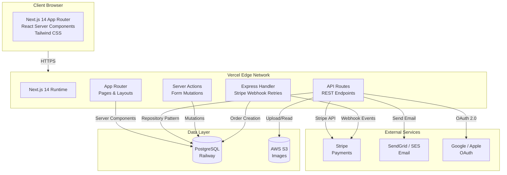
```mermaid
graph TB
    subgraph CLIENT["Client Browser"]
        NEXT["Next.js 14 App Router<br/>React Server Components<br/>Tailwind CSS"]
    end

    subgraph VERCE["Vercel Edge Network"]
        direction TB
        RUNTIME["Next.js 14 Runtime"]
        APP_ROUTER["App Router<br/>Pages & Layouts"]
        API["API Routes<br/>REST Endpoints"]
        SERVER_ACT["Server Actions<br/>Form Mutations"]
        EXPRESS["Express Handler<br/>Stripe Webhook Retries"]
    end

    subgraph EXTERNAL["External Services"]
        STRIPE["Stripe<br/>Payments"]
        EMAIL["SendGrid / SES<br/>Email"]
        OAUTH["Google / Apple<br/>OAuth"]
    end

    subgraph STORAGE["Data Layer"]
        PG[("PostgreSQL<br/>Railway")]
        S3[("AWS S3<br/>Images")]
    end

    CLIENT -->|HTTPS| VERCE
    APP_ROUTER -->|Server Components| PG
    API -->|Repository Pattern| PG
    SERVER_ACT -->|Mutations| PG
    API -->|Stripe API| STRIPE
    API -->|Send Email| EMAIL
    API -->|OAuth 2.0| OAUTH
    EXPRESS -->|Webhook Events| STRIPE
    EXPRESS -->|Order Creation| PG
    API -->|Upload/Read| S3
```

### B.2 — Database Entity Relationship

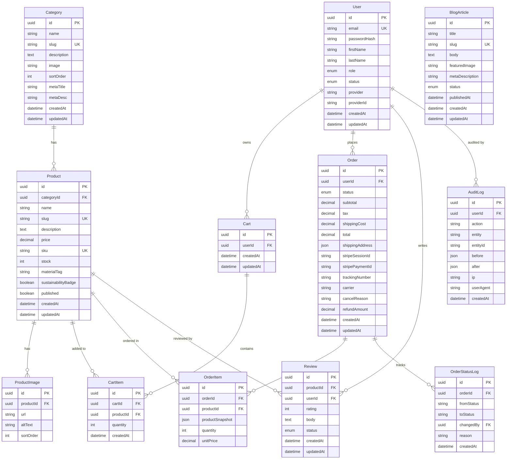
```mermaid
erDiagram
    Category ||--o{ Product : "has"
    Product ||--o{ ProductImage : "has"
    Product ||--o{ CartItem : "added to"
    Product ||--o{ OrderItem : "ordered in"
    Product ||--o{ Review : "reviewed by"
    User ||--o{ Cart : "owns"
    User ||--o{ Order : "places"
    User ||--o{ Review : "writes"
    Cart ||--o{ CartItem : "contains"
    Order ||--o{ OrderItem : "contains"
    Order ||--o{ OrderStatusLog : "tracks"
    User ||--o{ AuditLog : "audited by"

    Category {
        uuid id PK
        string name
        string slug UK
        text description
        string image
        int sortOrder
        string metaTitle
        string metaDesc
        datetime createdAt
        datetime updatedAt
    }

    Product {
        uuid id PK
        uuid categoryId FK
        string name
        string slug UK
        text description
        decimal price
        string sku UK
        int stock
        string materialTag
        boolean sustainabilityBadge
        boolean published
        datetime createdAt
        datetime updatedAt
    }

    ProductImage {
        uuid id PK
        uuid productId FK
        string url
        string altText
        int sortOrder
    }

    User {
        uuid id PK
        string email UK
        string passwordHash
        string firstName
        string lastName
        enum role
        enum status
        string provider
        string providerId
        datetime createdAt
        datetime updatedAt
    }

    Cart {
        uuid id PK
        uuid userId FK
        datetime createdAt
        datetime updatedAt
    }

    CartItem {
        uuid id PK
        uuid cartId FK
        uuid productId FK
        int quantity
        datetime createdAt
    }

    Order {
        uuid id PK
        uuid userId FK
        enum status
        decimal subtotal
        decimal tax
        decimal shippingCost
        decimal total
        json shippingAddress
        string stripeSessionId
        string stripePaymentId
        string trackingNumber
        string carrier
        string cancelReason
        decimal refundAmount
        datetime createdAt
        datetime updatedAt
    }

    OrderItem {
        uuid id PK
        uuid orderId FK
        uuid productId FK
        json productSnapshot
        int quantity
        decimal unitPrice
    }

    OrderStatusLog {
        uuid id PK
        uuid orderId FK
        string fromStatus
        string toStatus
        uuid changedBy FK
        string reason
        datetime createdAt
    }

    Review {
        uuid id PK
        uuid productId FK
        uuid userId FK
        int rating
        text body
        enum status
        datetime createdAt
        datetime updatedAt
    }

    BlogArticle {
        uuid id PK
        string title
        string slug UK
        text body
        string featuredImage
        string metaDescription
        enum status
        datetime publishedAt
        datetime createdAt
        datetime updatedAt
    }

    AuditLog {
        uuid id PK
        uuid userId FK
        string action
        string entity
        string entityId
        json before
        json after
        string ip
        string userAgent
        datetime createdAt
    }
```

### B.3 — Authentication Flow (JWT)

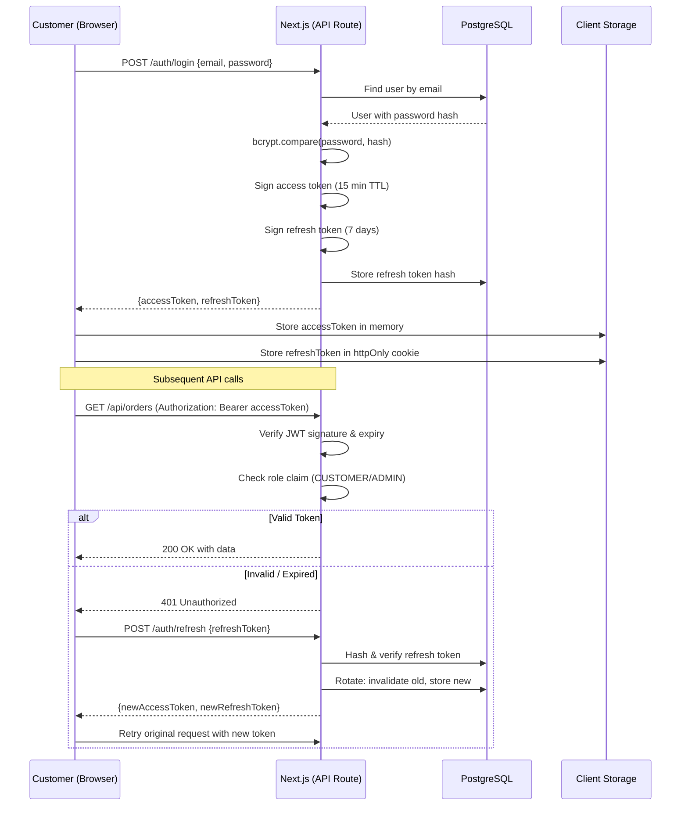
```mermaid
sequenceDiagram
    participant C as Customer (Browser)
    participant N as Next.js (API Route)
    participant D as PostgreSQL
    participant S as Client Storage

    C->>N: POST /auth/login {email, password}
    N->>D: Find user by email
    D-->>N: User with password hash
    N->>N: bcrypt.compare(password, hash)
    N->>N: Sign access token (15 min TTL)
    N->>N: Sign refresh token (7 days)
    N->>D: Store refresh token hash
    N-->>C: {accessToken, refreshToken}
    C->>S: Store accessToken in memory
    C->>S: Store refreshToken in httpOnly cookie
    Note over C,N: Subsequent API calls
    C->>N: GET /api/orders (Authorization: Bearer accessToken)
    N->>N: Verify JWT signature & expiry
    N->>N: Check role claim (CUSTOMER/ADMIN)
    alt Valid Token
        N-->>C: 200 OK with data
    else Invalid / Expired
        N-->>C: 401 Unauthorized
        C->>N: POST /auth/refresh {refreshToken}
        N->>D: Hash & verify refresh token
        N->>D: Rotate: invalidate old, store new
        N-->>C: {newAccessToken, newRefreshToken}
        C->>N: Retry original request with new token
    end
```

### B.4 — Checkout & Payment Flow

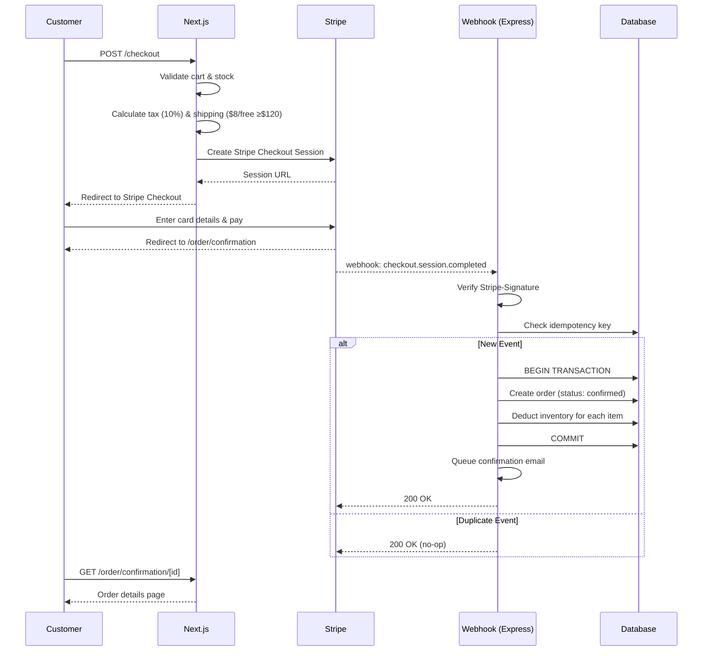
```mermaid
sequenceDiagram
    participant C as Customer
    participant N as Next.js
    participant S as Stripe
    participant W as Webhook (Express)
    participant D as Database

    C->>N: POST /checkout
    N->>N: Validate cart & stock
    N->>N: Calculate tax (10%) & shipping ($8/free ≥$120)
    N->>S: Create Stripe Checkout Session
    S-->>N: Session URL
    N-->>C: Redirect to Stripe Checkout
    C->>S: Enter card details & pay
    S-->>C: Redirect to /order/confirmation
    S-->>W: webhook: checkout.session.completed
    W->>W: Verify Stripe-Signature
    W->>D: Check idempotency key
    alt New Event
        W->>D: BEGIN TRANSACTION
        W->>D: Create order (status: confirmed)
        W->>D: Deduct inventory for each item
        W->>D: COMMIT
        W->>W: Queue confirmation email
        W-->>S: 200 OK
    else Duplicate Event
        W-->>S: 200 OK (no-op)
    end
    C->>N: GET /order/confirmation/[id]
    N-->>C: Order details page
```

### B.5 — Token Refresh Flow

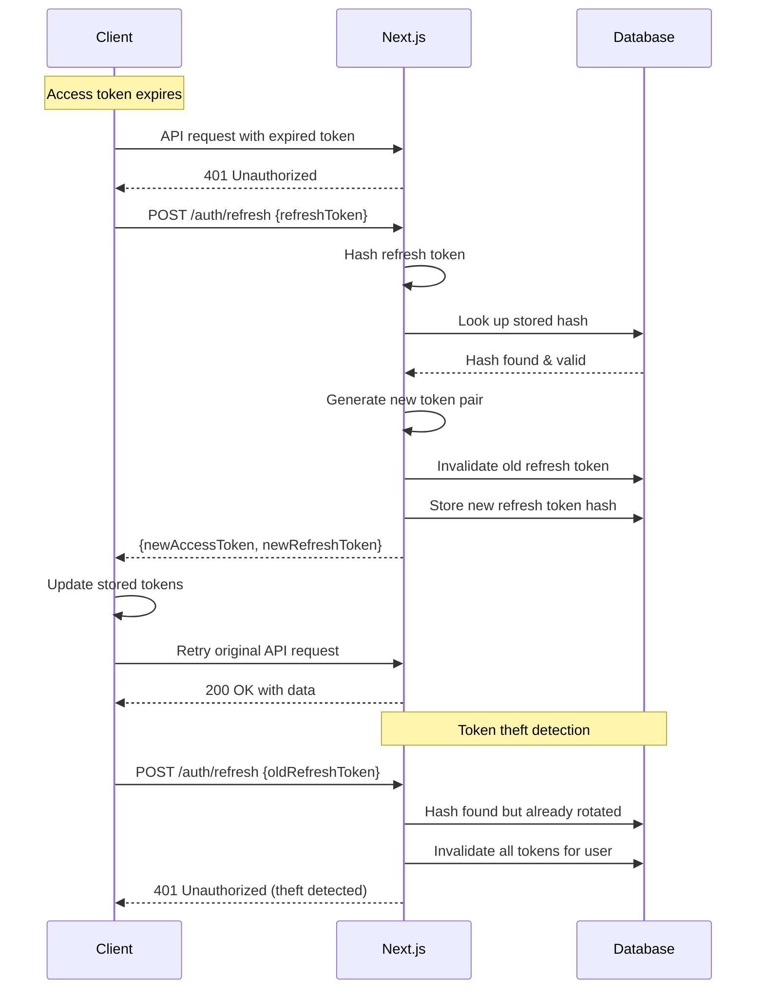
```mermaid
sequenceDiagram
    participant Cl as Client
    participant N as Next.js
    participant D as Database

    Note over Cl: Access token expires
    Cl->>N: API request with expired token
    N-->>Cl: 401 Unauthorized
    Cl->>N: POST /auth/refresh {refreshToken}
    N->>N: Hash refresh token
    N->>D: Look up stored hash
    D-->>N: Hash found & valid
    N->>N: Generate new token pair
    N->>D: Invalidate old refresh token
    N->>D: Store new refresh token hash
    N-->>Cl: {newAccessToken, newRefreshToken}
    Cl->>Cl: Update stored tokens
    Cl->>N: Retry original API request
    N-->>Cl: 200 OK with data

    Note over N,D: Token theft detection
    Cl->>N: POST /auth/refresh {oldRefreshToken}
    N->>D: Hash found but already rotated
    N->>D: Invalidate all tokens for user
    N-->>Cl: 401 Unauthorized (theft detected)
```

### B.6 — Component Architecture

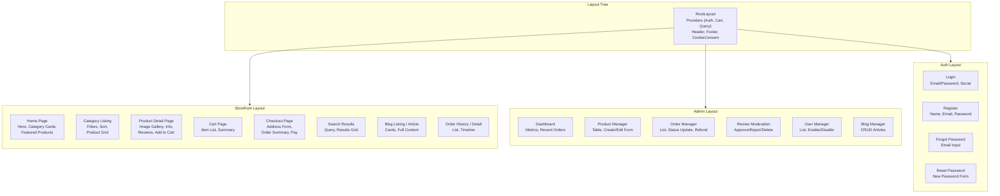
```mermaid
graph TB
    subgraph LAYOUT["Layout Tree"]
        RL["RootLayout<br/>Providers (Auth, Cart, Query)<br/>Header, Footer, CookieConsent"]
    end

    subgraph STOREFRONT["Storefront Layout"]
        direction TB
        HOME["Home Page<br/>Hero, Category Cards,<br/>Featured Products"]
        CAT["Category Listing<br/>Filters, Sort,<br/>Product Grid"]
        PDP["Product Detail Page<br/>Image Gallery, Info,<br/>Reviews, Add to Cart"]
        CART["Cart Page<br/>Item List, Summary"]
        CHK["Checkout Page<br/>Address Form,<br/>Order Summary, Pay"]
        SEARCH["Search Results<br/>Query, Results Grid"]
        BLOG["Blog Listing / Article<br/>Cards, Full Content"]
        ORDERS["Order History / Detail<br/>List, Timeline"]
    end

    subgraph ADMIN["Admin Layout"]
        direction TB
        DASH["Dashboard<br/>Metrics, Recent Orders"]
        PROD_MGR["Product Manager<br/>Table, Create/Edit Form"]
        ORD_MGR["Order Manager<br/>List, Status Update, Refund"]
        REV_MOD["Review Moderation<br/>Approve/Reject/Delete"]
        USER_MGR["User Manager<br/>List, Enable/Disable"]
        BLOG_MGR["Blog Manager<br/>CRUD Articles"]
    end

    subgraph AUTH["Auth Layout"]
        LOGIN["Login<br/>Email/Password, Social"]
        REG["Register<br/>Name, Email, Password"]
        FORGOT["Forgot Password<br/>Email Input"]
        RESET["Reset Password<br/>New Password Form"]
    end

    RL --> STOREFRONT
    RL --> ADMIN
    RL --> AUTH
```

### B.7 — Component Hierarchy

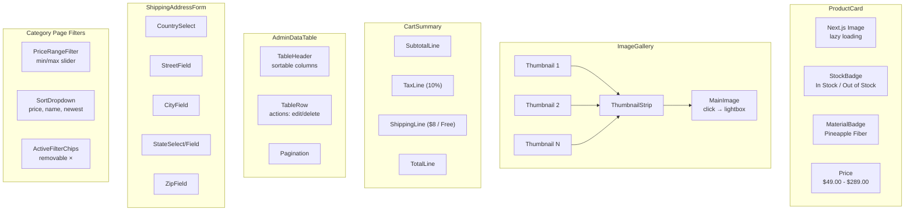
```mermaid
graph TB
    subgraph PRODUCT_CARD["ProductCard"]
        PC_IMG["Next.js Image<br/>lazy loading"]
        PC_STOCK["StockBadge<br/>In Stock / Out of Stock"]
        PC_MAT["MaterialBadge<br/>Pineapple Fiber"]
        PC_PRICE["Price<br/>$49.00 - $289.00"]
    end

    subgraph IMAGE_GALLERY["ImageGallery"]
        IG_THUMBS["ThumbnailStrip"]
        IG_THUMB["Thumbnail 1"] --> IG_THUMBS
        IG_THUMB2["Thumbnail 2"] --> IG_THUMBS
        IG_THUMB3["Thumbnail N"] --> IG_THUMBS
        IG_MAIN["MainImage<br/>click → lightbox"]
        IG_THUMBS --> IG_MAIN
    end

    subgraph CART_SUMMARY["CartSummary"]
        CS_SUB["SubtotalLine"]
        CS_TAX["TaxLine (10%)"]
        CS_SHIP["ShippingLine ($8 / Free)"]
        CS_TOTAL["TotalLine"]
    end

    subgraph ADMIN_TABLE["AdminDataTable"]
        AT_HEADER["TableHeader<br/>sortable columns"]
        AT_ROW["TableRow<br/>actions: edit/delete"]
        AT_PAG["Pagination"]
    end

    subgraph ADDRESS_FORM["ShippingAddressForm"]
        AF_COUNTRY["CountrySelect"]
        AF_STREET["StreetField"]
        AF_CITY["CityField"]
        AF_STATE["StateSelect/Field"]
        AF_ZIP["ZipField"]
    end

    subgraph FILTERS["Category Page Filters"]
        FILTER_PRICE["PriceRangeFilter<br/>min/max slider"]
        FILTER_SORT["SortDropdown<br/>price, name, newest"]
        FILTER_CHIPS["ActiveFilterChips<br/>removable ×"]
    end
```

### B.8 — Deployment Architecture

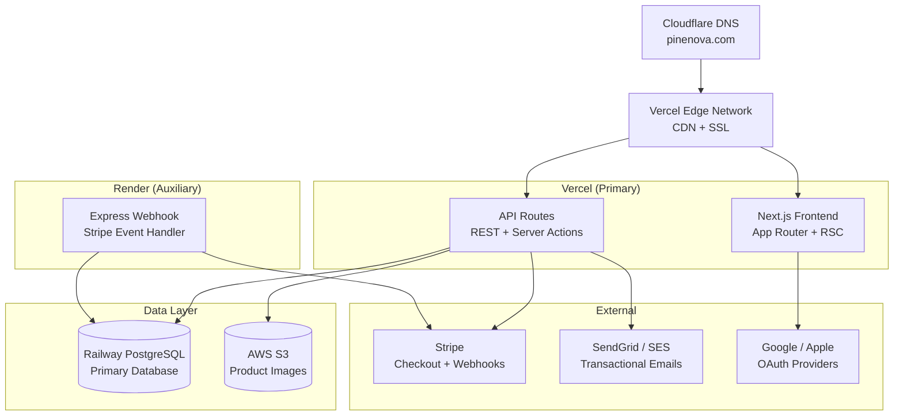
```mermaid
graph TB
    DNS["Cloudflare DNS<br/>pinenova.com"] --> EDGE["Vercel Edge Network<br/>CDN + SSL"]

    subgraph VERCE2["Vercel (Primary)"]
        FE["Next.js Frontend<br/>App Router + RSC"]
        API2["API Routes<br/>REST + Server Actions"]
    end

    subgraph RENDER2["Render (Auxiliary)"]
        WEBHOOK["Express Webhook<br/>Stripe Event Handler"]
    end

    subgraph DATA["Data Layer"]
        PG2[("Railway PostgreSQL<br/>Primary Database")]
        S3_2[("AWS S3<br/>Product Images")]
    end

    subgraph EXTERNAL2["External"]
        STRIPE2["Stripe<br/>Checkout + Webhooks"]
        EMAIL2["SendGrid / SES<br/>Transactional Emails"]
        OAUTH2["Google / Apple<br/>OAuth Providers"]
    end

    EDGE --> FE
    EDGE --> API2
    API2 --> PG2
    API2 --> S3_2
    API2 --> STRIPE2
    API2 --> EMAIL2
    FE --> OAUTH2
    WEBHOOK --> STRIPE2
    WEBHOOK --> PG2
```

### B.9 — Security Architecture


```mermaid
graph LR
    subgraph L1["Layer 1: Transport"]
        HSTS["HSTS<br/>max-age 31536000"]
        TLS["TLS 1.2+"]
    end

    subgraph L2["Layer 2: HTTP Headers"]
        CSP["Content-Security-Policy"]
        XFO["X-Frame-Options: DENY"]
        CT["X-Content-Type-Options: nosniff"]
        REF["Referrer-Policy"]
    end

    subgraph L3["Layer 3: Authentication"]
        JWT["JWT Access + Refresh<br/>15 min / 7 days"]
        BCRYPT["bcrypt cost ≥ 12"]
        RL["5 failed logins<br/>per 15 min"]
    end

    subgraph L4["Layer 4: Authorization"]
        RBAC["Role-Based<br/>CUSTOMER / ADMIN"]
        SIDE["Server-Side Enforcement"]
        ISO["Data Isolation<br/>by user ID"]
    end

    subgraph L5["Layer 5: Input Validation"]
        ZOD["Zod Schemas<br/>Shared Client/Server"]
        FILE["File Upload<br/>Type + Size Check"]
    end

    subgraph L6["Layer 6: Payment"]
        PCI["PCI DSS SAQ A"]
        CHECKOUT["Stripe Checkout<br/>Card never touches server"]
        SIG["Webhook Signature<br/>Verification"]
    end

    subgraph L7["Layer 7: Rate Limiting"]
        RL100["100 req/min<br/>Unauthenticated"]
        RL300["300 req/min<br/>Authenticated"]
    end

    subgraph L8["Layer 8: Data Protection"]
        NOSEC["No Secrets in Source"]
        REDACT["PII Redacted from Logs"]
        CSRF["CSRF Protection<br/>SameSite Cookies"]
        SQLI["SQL Injection<br/>Prisma ORM"]
        XSS["XSS Prevention<br/>React + CSP"]
    end

    L1 --> L2 --> L3 --> L4 --> L5 --> L6 --> L7 --> L8
```

### B.10 — Error Handling Flow

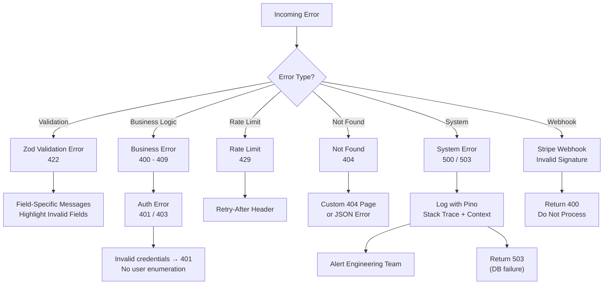
```mermaid
flowchart TD
    ERROR["Incoming Error"] --> DECIDE{"Error Type?"}

    DECIDE -->|Validation| ZOD_ERR["Zod Validation Error<br/>422"]
    ZOD_ERR --> FIELD["Field-Specific Messages<br/>Highlight Invalid Fields"]

    DECIDE -->|Business Logic| BIZ["Business Error<br/>400 - 409"]
    BIZ --> AUTH_ERR["Auth Error<br/>401 / 403"]
    AUTH_ERR --> LOGIN_ERR["Invalid credentials → 401<br/>No user enumeration"]

    DECIDE -->|Rate Limit| RATE["Rate Limit<br/>429"]
    RATE --> HEADER["Retry-After Header"]

    DECIDE -->|Not Found| NF["Not Found<br/>404"]
    NF --> PAGE404["Custom 404 Page<br/>or JSON Error"]

    DECIDE -->|System| SYS["System Error<br/>500 / 503"]
    SYS --> LOG["Log with Pino<br/>Stack Trace + Context"]
    LOG --> ALERT["Alert Engineering Team"]
    LOG --> RETURN["Return 503<br/>(DB failure)"]

    DECIDE -->|Webhook| WH["Stripe Webhook<br/>Invalid Signature"]
    WH --> WH_400["Return 400<br/>Do Not Process"]
```

### B.11 — Workflow: Customer Registration & Login

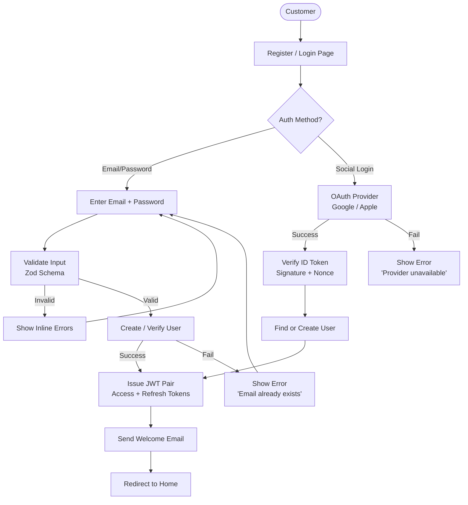
```mermaid
flowchart TD
    START(["Customer"]) --> PAGE["Register / Login Page"]
    PAGE --> CHOICE{"Auth Method?"}

    CHOICE -->|Email/Password| EP["Enter Email + Password"]
    EP --> VALIDATE["Validate Input<br/>Zod Schema"]
    VALIDATE -->|Invalid| SHOW_ERR["Show Inline Errors"]
    SHOW_ERR --> EP
    VALIDATE -->|Valid| CREATE["Create / Verify User"]
    CREATE -->|Success| JWT_ISSUE["Issue JWT Pair<br/>Access + Refresh Tokens"]
    JWT_ISSUE --> WELCOME_EM["Send Welcome Email"]
    WELCOME_EM --> REDIRECT_HOME["Redirect to Home"]
    CREATE -->|Fail| SHOW_ERR2["Show Error<br/>'Email already exists'"]
    SHOW_ERR2 --> EP

    CHOICE -->|Social Login| SOCIAL["OAuth Provider<br/>Google / Apple"]
    SOCIAL -->|Success| VERIFY_TOKEN["Verify ID Token<br/>Signature + Nonce"]
    VERIFY_TOKEN --> FIND_USER["Find or Create User"]
    FIND_USER --> JWT_ISSUE
    SOCIAL -->|Fail| SHOW_ERR3["Show Error<br/>'Provider unavailable'"]
```

### B.12 — Workflow: Product Discovery to Purchase

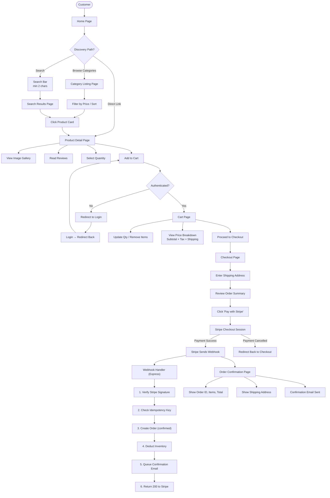
```mermaid
flowchart TD
    START2(["Customer"]) --> HOME["Home Page"]
    HOME --> DISCOVERY{"Discovery Path?"}

    DISCOVERY -->|Browse Categories| CAT_LIST["Category Listing Page"]
    CAT_LIST --> FILTER["Filter by Price / Sort"]
    FILTER --> CLICK["Click Product Card"]

    DISCOVERY -->|Search| SEARCH_BAR["Search Bar<br/>min 2 chars"]
    SEARCH_BAR --> SEARCH_RES["Search Results Page"]
    SEARCH_RES --> CLICK

    DISCOVERY -->|Direct Link| PDP["Product Detail Page"]

    CLICK --> PDP
    PDP --> VIEW_GALLERY["View Image Gallery"]
    PDP --> READ_REVIEWS["Read Reviews"]
    PDP --> SELECT_QTY["Select Quantity"]
    PDP --> ADD_CART["Add to Cart"]

    ADD_CART --> AUTH_CHECK{"Authenticated?"}
    AUTH_CHECK -->|No| REDIRECT_LOGIN["Redirect to Login"]
    REDIRECT_LOGIN --> LOGIN_OK["Login → Redirect Back"]
    LOGIN_OK --> ADD_CART
    AUTH_CHECK -->|Yes| CART_PAGE["Cart Page"]

    CART_PAGE --> MANAGE["Update Qty / Remove Items"]
    CART_PAGE --> VIEW_BREAKDOWN["View Price Breakdown<br/>Subtotal + Tax + Shipping"]
    CART_PAGE --> PROCEED_CHECKOUT["Proceed to Checkout"]

    PROCEED_CHECKOUT --> CHECKOUT_PAGE["Checkout Page"]
    CHECKOUT_PAGE --> SHIPPING["Enter Shipping Address"]
    SHIPPING --> REVIEW["Review Order Summary"]
    REVIEW --> PAY["Click 'Pay with Stripe'"]

    PAY --> STRIPE_CHECKOUT["Stripe Checkout Session"]
    STRIPE_CHECKOUT -->|Payment Success| WEBHOOK_SENT["Stripe Sends Webhook"]
    STRIPE_CHECKOUT -->|Payment Cancelled| CANCEL_BACK["Redirect Back to Checkout"]

    WEBHOOK_SENT --> WEBHOOK_HANDLER["Webhook Handler (Express)"]
    WEBHOOK_HANDLER --> VERIFY_SIG["1. Verify Stripe Signature"]
    VERIFY_SIG --> IDEMPOTENCY["2. Check Idempotency Key"]
    IDEMPOTENCY --> CREATE_ORDER["3. Create Order (confirmed)"]
    CREATE_ORDER --> DEDUCT_STOCK["4. Deduct Inventory"]
    DEDUCT_STOCK --> QUEUE_EMAIL["5. Queue Confirmation Email"]
    QUEUE_EMAIL --> RETURN_200["6. Return 200 to Stripe"]

    WEBHOOK_SENT --> CONFIRMATION["Order Confirmation Page"]
    CONFIRMATION --> ORDER_ID["Show Order ID, Items, Total"]
    CONFIRMATION --> SHIP_ADDR["Show Shipping Address"]
    CONFIRMATION --> EMAIL_SENT["Confirmation Email Sent"]
```

### B.13 — Workflow: Order Fulfillment (Admin)

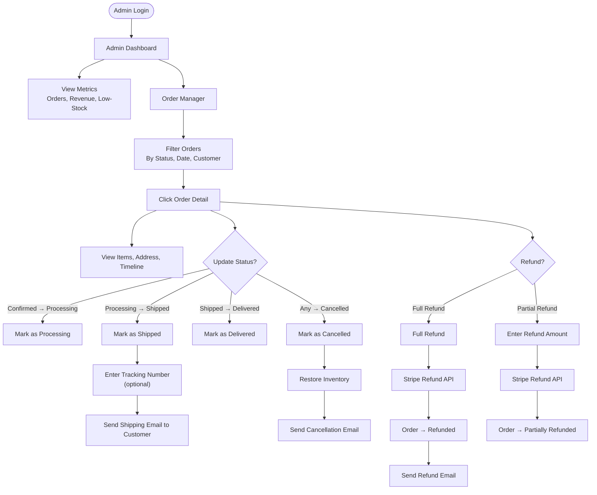
```mermaid
flowchart TD
    ADMIN_LOGIN(["Admin Login"]) --> DASHBOARD["Admin Dashboard"]
    DASHBOARD --> VIEW_METRICS["View Metrics<br/>Orders, Revenue, Low-Stock"]
    DASHBOARD --> ORDER_MGR["Order Manager"]

    ORDER_MGR --> FILTER_ORDERS["Filter Orders<br/>By Status, Date, Customer"]
    FILTER_ORDERS --> ORDER_DETAIL["Click Order Detail"]

    ORDER_DETAIL --> VIEW_ITEMS["View Items, Address, Timeline"]

    ORDER_DETAIL --> UPDATE_STATUS{"Update Status?"}

    UPDATE_STATUS -->|Confirmed → Processing| PROCESSING["Mark as Processing"]
    UPDATE_STATUS -->|Processing → Shipped| SHIPPED["Mark as Shipped"]
    SHIPPED --> ENTER_TRACKING["Enter Tracking Number<br/>(optional)"]
    ENTER_TRACKING --> SEND_SHIP_EM["Send Shipping Email to Customer"]

    UPDATE_STATUS -->|Shipped → Delivered| DELIVERED["Mark as Delivered"]

    UPDATE_STATUS -->|Any → Cancelled| CANCEL["Mark as Cancelled"]
    CANCEL --> RESTORE_STOCK["Restore Inventory"]
    RESTORE_STOCK --> SEND_CANCEL_EM["Send Cancellation Email"]

    ORDER_DETAIL --> REFUND{"Refund?"}
    REFUND -->|Full Refund| FULL_REF["Full Refund"]
    FULL_REF --> STRIPE_REF["Stripe Refund API"]
    STRIPE_REF --> REF_STATUS["Order → Refunded"]
    REF_STATUS --> SEND_REF_EM["Send Refund Email"]

    REFUND -->|Partial Refund| PARTIAL_REF["Enter Refund Amount"]
    PARTIAL_REF --> STRIPE_REF2["Stripe Refund API"]
    STRIPE_REF2 --> PARTIAL_STATUS["Order → Partially Refunded"]
```

### B.14 — Workflow: Product Review

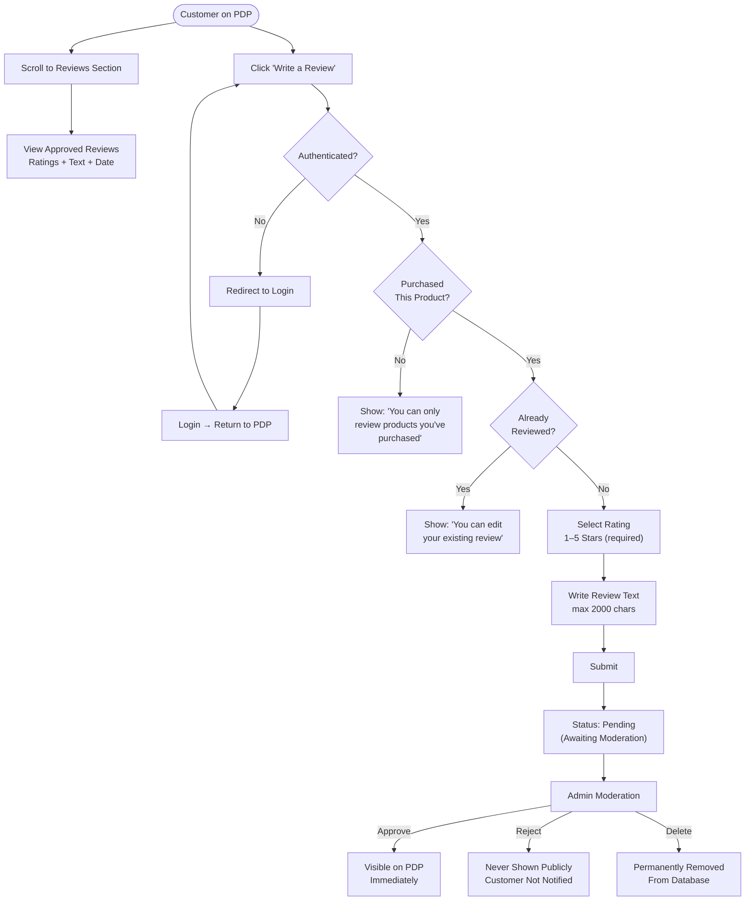
```mermaid
flowchart TD
    CUST_PDP(["Customer on PDP"]) --> SCROLL["Scroll to Reviews Section"]
    SCROLL --> READ_REVS["View Approved Reviews<br/>Ratings + Text + Date"]

    CUST_PDP --> CLICK_WRITE["Click 'Write a Review'"]

    CLICK_WRITE --> AUTH_CHECK2{"Authenticated?"}
    AUTH_CHECK2 -->|No| REDIR_LOGIN["Redirect to Login"]
    REDIR_LOGIN --> LOGIN_BACK["Login → Return to PDP"]
    LOGIN_BACK --> CLICK_WRITE

    AUTH_CHECK2 -->|Yes| PURCHASE_CHECK{"Purchased<br/>This Product?"}
    PURCHASE_CHECK -->|No| BLOCK_MSG["Show: 'You can only<br/>review products you've<br/>purchased'"]
    PURCHASE_CHECK -->|Yes| DUPE_CHECK{"Already<br/>Reviewed?"}
    DUPE_CHECK -->|Yes| EDIT_MSG["Show: 'You can edit<br/>your existing review'"]
    DUPE_CHECK -->|No| RATING["Select Rating<br/>1–5 Stars (required)"]
    RATING --> BODY["Write Review Text<br/>max 2000 chars"]
    BODY --> SUBMIT["Submit"]

    SUBMIT --> PENDING["Status: Pending<br/>(Awaiting Moderation)"]
    PENDING --> ADMIN_MOD["Admin Moderation"]

    ADMIN_MOD -->|Approve| VISIBLE["Visible on PDP<br/>Immediately"]
    ADMIN_MOD -->|Reject| HIDDEN["Never Shown Publicly<br/>Customer Not Notified"]
    ADMIN_MOD -->|Delete| REMOVED["Permanently Removed<br/>From Database"]
```

### B.15 — Workflow: Inventory Low-Stock Alert

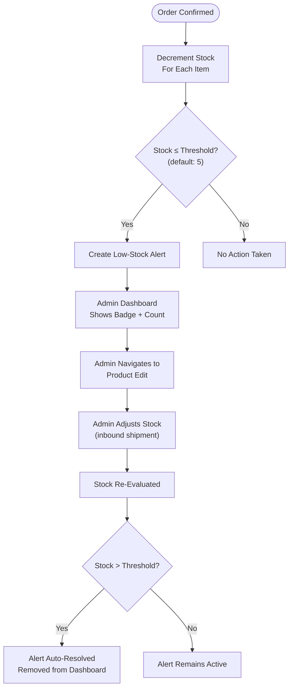
```mermaid
flowchart TD
    ORDER_CONF(["Order Confirmed"]) --> DECREMENT["Decrement Stock<br/>For Each Item"]
    DECREMENT --> CHECK_THRESHOLD{"Stock ≤ Threshold?<br/>(default: 5)"}

    CHECK_THRESHOLD -->|Yes| CREATE_ALERT["Create Low-Stock Alert"]
    CREATE_ALERT --> DASH_BADGE["Admin Dashboard<br/>Shows Badge + Count"]
    DASH_BADGE --> ADMIN_NAV["Admin Navigates to<br/>Product Edit"]
    ADMIN_NAV --> ADJUST["Admin Adjusts Stock<br/>(inbound shipment)"]
    ADJUST --> RE_EVAL["Stock Re-Evaluated"]
    RE_EVAL --> RESOLVED{"Stock > Threshold?"}
    RESOLVED -->|Yes| AUTO_RESOLVE["Alert Auto-Resolved<br/>Removed from Dashboard"]
    RESOLVED -->|No| REMAINS["Alert Remains Active"]

    CHECK_THRESHOLD -->|No| NO_ACTION["No Action Taken"]
```

### B.16 — Workflow: Password Reset

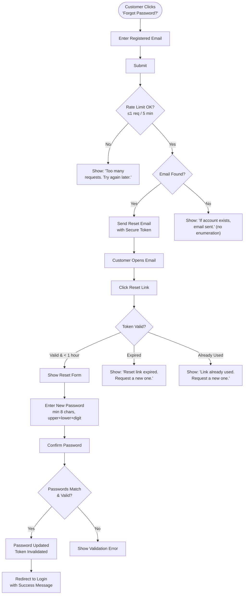
```mermaid
flowchart TD
    FORGOT_LINK(["Customer Clicks<br/>'Forgot Password?'"]) --> EMAIL_INPUT["Enter Registered Email"]
    EMAIL_INPUT --> SUBMIT_EMAIL["Submit"]

    SUBMIT_EMAIL --> RATE_CHECK{"Rate Limit OK?<br/>≤1 req / 5 min"}
    RATE_CHECK -->|No| RATE_BLOCK["Show: 'Too many<br/>requests. Try again later.'"]
    RATE_CHECK -->|Yes| LOOKUP{"Email Found?"}

    LOOKUP -->|Yes| SEND_EMAIL["Send Reset Email<br/>with Secure Token"]
    LOOKUP -->|No| NO_ENUM["Show: 'If account exists,<br/>email sent.' (no enumeration)"]

    SEND_EMAIL --> CUSTOMER_EMAIL["Customer Opens Email"]
    CUSTOMER_EMAIL --> CLICK_LINK["Click Reset Link"]

    CLICK_LINK --> TOKEN_CHECK{"Token Valid?"}

    TOKEN_CHECK -->|Valid & < 1 hour| RESET_FORM["Show Reset Form"]
    RESET_FORM --> NEW_PASS["Enter New Password<br/>min 8 chars, upper+lower+digit"]
    NEW_PASS --> CONFIRM_PASS["Confirm Password"]
    CONFIRM_PASS --> MATCH{"Passwords Match<br/>& Valid?"}
    MATCH -->|Yes| UPDATE["Password Updated<br/>Token Invalidated"]
    UPDATE --> REDIR_LOGIN2["Redirect to Login<br/>with Success Message"]
    MATCH -->|No| SHOW_ERROR["Show Validation Error"]

    TOKEN_CHECK -->|Expired| EXPIRED["Show: 'Reset link expired.<br/>Request a new one.'"]
    TOKEN_CHECK -->|Already Used| USED["Show: 'Link already used.<br/>Request a new one.'"]
```

### B.17 — Workflow: Admin Product CRUD

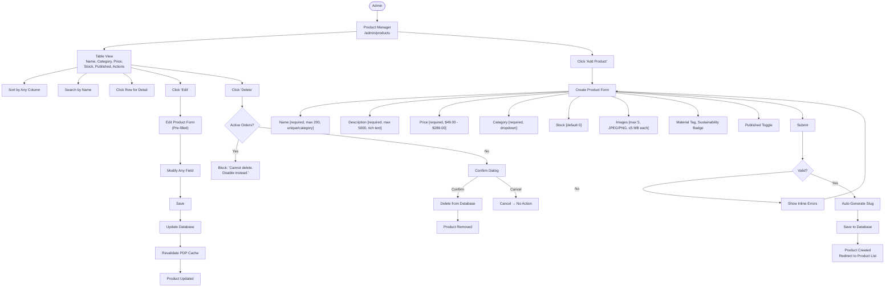
```mermaid
flowchart TD
    ADMIN_DASH(["Admin"]) --> PRODUCT_MGR["Product Manager<br/>/admin/products"]
    PRODUCT_MGR --> TABLE["Table View<br/>Name, Category, Price,<br/>Stock, Published, Actions"]

    TABLE --> SORT["Sort by Any Column"]
    TABLE --> SEARCH["Search by Name"]
    TABLE --> CLICK_ROW["Click Row for Detail"]

    PRODUCT_MGR --> CREATE_BTN["Click 'Add Product'"]

    CREATE_BTN --> CREATE_FORM["Create Product Form"]
    CREATE_FORM --> NAME["Name [required, max 200, unique/category]"]
    CREATE_FORM --> DESC["Description [required, max 5000, rich text]"]
    CREATE_FORM --> PRICE["Price [required, $49.00 - $289.00]"]
    CREATE_FORM --> CATEGORY["Category [required, dropdown]"]
    CREATE_FORM --> STOCK["Stock [default 0]"]
    CREATE_FORM --> IMAGES["Images [max 5, JPEG/PNG, ≤5 MB each]"]
    CREATE_FORM --> TOGGLES["Material Tag, Sustainability Badge"]
    CREATE_FORM --> PUBLISHED["Published Toggle"]
    CREATE_FORM --> SUBMIT["Submit"]

    SUBMIT --> VALIDATE{"Valid?"}
    VALIDATE -->|No| SHOW_FORM_ERR["Show Inline Errors"]
    SHOW_FORM_ERR --> CREATE_FORM
    VALIDATE -->|Yes| AUTO_SLUG["Auto-Generate Slug"]
    AUTO_SLUG --> SAVE["Save to Database"]
    SAVE --> SUCCESS["Product Created<br/>Redirect to Product List"]

    TABLE --> EDIT_BTN["Click 'Edit'"]
    EDIT_BTN --> EDIT_FORM["Edit Product Form<br/>(Pre-filled)"]
    EDIT_FORM --> MODIFY["Modify Any Field"]
    MODIFY --> SAVE_EDIT["Save"]
    SAVE_EDIT --> UPDATE_DB["Update Database"]
    UPDATE_DB --> REVALIDATE["Revalidate PDP Cache"]
    REVALIDATE --> EDIT_SUCCESS["Product Updated"]

    TABLE --> DELETE_BTN["Click 'Delete'"]
    DELETE_BTN --> ORDER_CHECK{"Active Orders?"}
    ORDER_CHECK -->|Yes| BLOCK_DEL["Block: 'Cannot delete.<br/>Disable instead.'"]
    ORDER_CHECK -->|No| CONFIRM["Confirm Dialog"]
    CONFIRM -->|Confirm| DELETE_DB["Delete from Database"]
    DELETE_DB --> DEL_SUCCESS["Product Removed"]
    CONFIRM -->|Cancel| CANCEL_DEL["Cancel → No Action"]
```

### B.18 — State Management Strategy

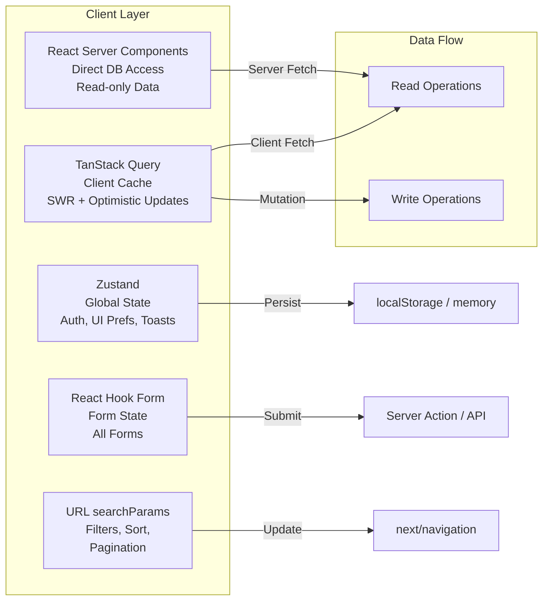
```mermaid
graph LR
    subgraph CLIENT_LAYER["Client Layer"]
        RSC["React Server Components<br/>Direct DB Access<br/>Read-only Data"]
        TQ["TanStack Query<br/>Client Cache<br/>SWR + Optimistic Updates"]
        ZUSTAND["Zustand<br/>Global State<br/>Auth, UI Prefs, Toasts"]
        RHF["React Hook Form<br/>Form State<br/>All Forms"]
        URL["URL searchParams<br/>Filters, Sort,<br/>Pagination"]
    end

    subgraph DATA_FLOW["Data Flow"]
        READ["Read Operations"]
        WRITE["Write Operations"]
    end

    RSC -->|Server Fetch| READ
    TQ -->|Client Fetch| READ
    TQ -->|Mutation| WRITE
    ZUSTAND -->|Persist| LOCAL["localStorage / memory"]
    RHF -->|Submit| SERVER_ACTION["Server Action / API"]
    URL -->|Update| NAV["next/navigation"]
```

### B.19 — Middleware Pipeline

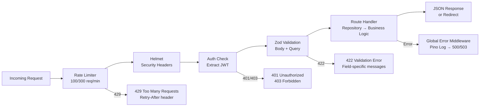
```mermaid
flowchart LR
    REQ["Incoming Request"] --> RL_MW["Rate Limiter<br/>100/300 req/min"]
    RL_MW --> HELMET["Helmet<br/>Security Headers"]
    HELMET --> AUTH_MW["Auth Check<br/>Extract JWT"]
    AUTH_MW --> ZOD_MW["Zod Validation<br/>Body + Query"]
    ZOD_MW --> HANDLER["Route Handler<br/>Repository → Business Logic"]
    HANDLER --> RESPONSE["JSON Response<br/>or Redirect"]

    RL_MW -->|429| RL_RESP["429 Too Many Requests<br/>Retry-After header"]
    AUTH_MW -->|401/403| AUTH_RESP["401 Unauthorized<br/>403 Forbidden"]
    ZOD_MW -->|422| ZOD_RESP["422 Validation Error<br/>Field-specific messages"]
    HANDLER -->|Error| ERR_MW["Global Error Middleware<br/>Pino Log → 500/503"]
```

### B.20 — Caching Strategy

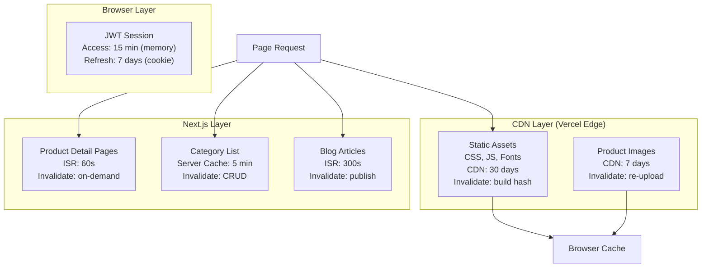
```mermaid
graph TD
    subgraph CDN["CDN Layer (Vercel Edge)"]
        STATIC["Static Assets<br/>CSS, JS, Fonts<br/>CDN: 30 days<br/>Invalidate: build hash"]
        IMAGES["Product Images<br/>CDN: 7 days<br/>Invalidate: re-upload"]
    end

    subgraph NEXT["Next.js Layer"]
        PDP_CACHE["Product Detail Pages<br/>ISR: 60s<br/>Invalidate: on-demand"]
        CAT_CACHE["Category List<br/>Server Cache: 5 min<br/>Invalidate: CRUD"]
        BLOG_CACHE["Blog Articles<br/>ISR: 300s<br/>Invalidate: publish"]
    end

    subgraph BROWSER["Browser Layer"]
        SESSION["JWT Session<br/>Access: 15 min (memory)<br/>Refresh: 7 days (cookie)"]
    end

    REQUEST["Page Request"] --> STATIC
    REQUEST --> PDP_CACHE
    REQUEST --> CAT_CACHE
    REQUEST --> BLOG_CACHE
    STATIC --> BROWSER_1["Browser Cache"]
    IMAGES --> BROWSER_1
```

### B.21 — Integration Architecture

```mermaid
graph TB
    subgraph PINENOVA["PineNova Platform"]
        API_R["API Routes"]
        WH_R["Webhook Handler"]
    end

    subgraph STRIPE_INT["Stripe"]
        CHECKOUT_S["Checkout Session API<br/>HTTPS REST<br/>Outbound"]
        WEBHOOK_S["Webhook Events<br/>checkout.session.completed<br/>charge.refunded<br/>Inbound"]
        REFUND_S["Refund API<br/>HTTPS REST<br/>Outbound"]
    end

    subgraph EMAIL_INT["Email Service"]
        SEND["SendGrid / SES<br/>SMTP / API<br/>Outbound<br/>Retry: 3x linear"]
    end

    subgraph OAUTH_INT["OAuth Providers"]
        GOOGLE["Google OAuth 2.0<br/>OIDC<br/>Bidirectional"]
        APPLE["Apple OAuth 2.0<br/>OIDC<br/>Bidirectional"]
    end

    subgraph S3_INT["Object Storage"]
        AWS["AWS S3<br/>HTTP REST<br/>Bidirectional<br/>Versioning enabled"]
    end

    API_R -->|Create Session| CHECKOUT_S
    WEBHOOK_S -->|Event POST| WH_R
    API_R -->|Refund| REFUND_S
    API_R -->|Send Template| SEND
    API_R -->|Verify| GOOGLE
    API_R -->|Verify| APPLE
    API_R -->|Upload/Read| AWS

    WH_R -->|Verify Signature| WEBHOOK_S
```

### B.22 — Monitoring & Observability Stack

```mermaid
graph TB
    subgraph SOURCES["Data Sources"]
        API_LOGS["API Routes<br/>Request/Response Logs"]
        DB_LOGS["Database<br/>Query Logs"]
        APP["Application<br/>Errors & Metrics"]
        SYNTH["Synthetic Checks<br/>Playwright E2E"]
    end

    subgraph COLLECTION["Collection & Processing"]
        PINO["Pino Logger<br/>Structured JSON<br/>stdout"]
        CORR["Correlation IDs<br/>Request Tracing"]
    end

    subgraph METRICS["Metrics & Alerting"]
        METRIC_SET["Request Rate<br/>Error Rate (5xx)<br/>P50/P95/P99 Latency<br/>Active Users<br/>Order Count<br/>Revenue"]
        ALERTS["Error Rate > 1%<br/>P95 > 1s<br/>DB Pool > 80%<br/>Webhook Failures<br/>Disk > 80%"]
    end

    subgraph VISUAL["Visualization"]
        DASH["Engineering Dashboard<br/>Real-time Metrics"]
        UPTIME["Uptime Monitor<br/>1-min intervals<br/>99.9% SLA"]
    end

    API_LOGS --> PINO
    DB_LOGS --> PINO
    APP --> PINO
    PINO --> CORR
    CORR --> METRIC_SET
    METRIC_SET --> ALERTS
    METRIC_SET --> DASH
    SYNTH --> UPTIME
    SYNTH --> ALERTS
```

### B.23 — Audit Trail Schema

```mermaid
erDiagram
    AuditLog {
        uuid id PK
        uuid userId FK
        string action "LOGIN_SUCCESS | ORDER_CREATED | PRODUCT_UPDATED | etc."
        string entity "User | Order | Product | Review | etc."
        string entityId "UUID of the affected entity"
        json before "Previous state (nullable)"
        json after "New state (nullable)"
        string ip "Request IP address"
        string userAgent "Browser user agent"
        datetime createdAt "Immutable timestamp"
    }

    %% Retention Rules
    %% 7 years: Order events
    %% 1 year: Admin CRUD, Inventory
    %% 90 days: Auth events, Payment events
    %% 30 days: Password reset, Email sent, Rate limit
```

### B.24 — Environment Variable Dependency Map

```mermaid
graph LR
    subgraph ENV["Environment Variables"]
        DB_URL["DATABASE_URL"]
        JWT_S["JWT_SECRET"]
        JWT_RS["JWT_REFRESH_SECRET"]
        STRIPE_SK["STRIPE_SECRET_KEY"]
        STRIPE_WS["STRIPE_WEBHOOK_SECRET"]
        STRIPE_PK["NEXT_PUBLIC_STRIPE_PUBLISHABLE_KEY"]
        S3_AK["S3_ACCESS_KEY"]
        S3_SK["S3_SECRET_KEY"]
        S3_BUCKET["S3_BUCKET_NAME"]
        S3_REGION["S3_REGION"]
        EMAIL_FROM["EMAIL_FROM"]
        EMAIL_KEY["EMAIL_API_KEY"]
        GOOGLE["GOOGLE_CLIENT_ID"]
        APPLE["APPLE_CLIENT_ID"]
        APP_URL["NEXT_PUBLIC_APP_URL"]
        NODE_ENV["NODE_ENV"]
    end

    subgraph MODULES["Consuming Modules"]
        PRISMA["Prisma ORM"]
        AUTH["Auth Module<br/>JWT + bcrypt"]
        STRIPE_M["Stripe Payments"]
        S3_M["S3 Image Upload"]
        EMAIL_M["Email Service"]
        OAUTH_M["OAuth Login"]
        DEPLOY["Deployment Config"]
    end

    DB_URL --> PRISMA
    JWT_S --> AUTH
    JWT_RS --> AUTH
    STRIPE_SK --> STRIPE_M
    STRIPE_WS --> STRIPE_M
    STRIPE_PK --> STRIPE_M
    S3_AK --> S3_M
    S3_SK --> S3_M
    S3_BUCKET --> S3_M
    S3_REGION --> S3_M
    EMAIL_FROM --> EMAIL_M
    EMAIL_KEY --> EMAIL_M
    GOOGLE --> OAUTH_M
    APPLE --> OAUTH_M
    APP_URL --> DEPLOY
    NODE_ENV --> DEPLOY
```
